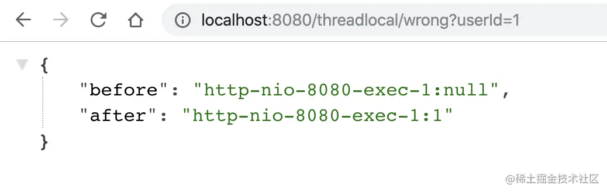
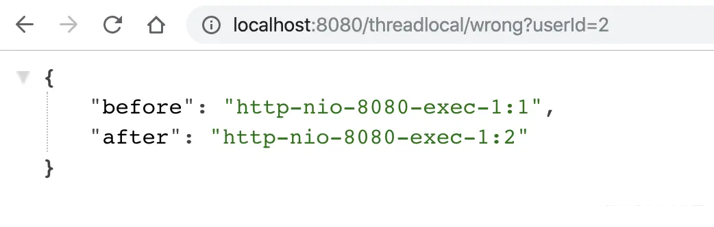
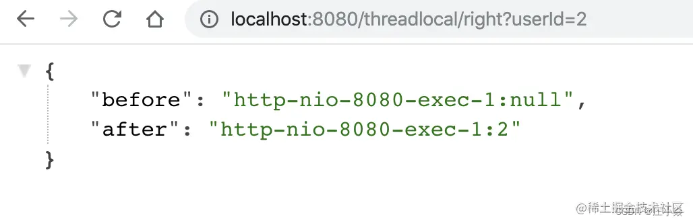

# 业务常见error示例——并发工具类库导致的线程安全问题 

# 摘要

通常提到线程安全问题等就有可能听到关线程安全和并发工具的一些片面的观点和结论。
比如“把 HashMap改为 ConcurrentHashMap，就可以解决并发问题了呀”“要不我们试试无锁的CopyOnWriteArrayList吧，
性能更好”。的确，为了方便开发者进行多线程编程，现代编程语言会提供各种并发工具类。
但如果我们没有充分了解它们的使用场景、解决的问题，以及最佳实践的话，盲目使用就可能会导致一些坑，
小则损失性能，大则无法确保多线程情况下业务逻辑正确性。

# 一、线程重用导致用户信息错乱的 Bug
之前有业务同学和我反馈，在生产上遇到一个诡异的问题，有时获取到的用户信息是别人的。查看代码后，
我发现他使用了ThreadLocal 来缓存获取到的用户信息。我们知道，ThreadLocal 适用于变量在线程间隔离，
而在方法或类间共享的场景。如果用户信息的获取比较昂贵（比如从数据库查询用户信息），
那么在 ThreadLocal 中缓存数据是比较合适的做法。但，这么做为什么会出现用户信息错乱的 Bug 呢？

使用 Spring Boot 创建一个 Web 应用程序，使用 ThreadLocal 存放一个 Integer 的值，
来暂且代表需要在线程中保存的用户信息，这个值初始是 null。在业务逻辑中，
我先从 ThreadLocal 获取一次值，然后把外部传入的参数设置到 ThreadLocal 中，
来模拟从当前上下文获取到用户信息的逻辑，随后再获取一次值，最后输出两次获得的值和线程名称。

```java
private static final ThreadLocal<Integer> currentUser = ThreadLocal.withInitial(() -> null);

@GetMapping("wrong")
public Map wrong(@RequestParam("userId") Integer userId) {
    //设置用户信息之前先查询一次ThreadLocal中的用户信息
    String before  = Thread.currentThread().getName() + ":" + currentUser.get();
    //设置用户信息到ThreadLocal
    currentUser.set(userId);
    //设置用户信息之后再查询一次ThreadLocal中的用户信息
    String after  = Thread.currentThread().getName() + ":" + currentUser.get();
    //汇总输出两次查询结果
    Map result = new HashMap();
    result.put("before", before);
    result.put("after", after);
    return result;
}
```

按理说，在设置用户信息之前第一次获取的值始终应该是 null，但我们要意识到，程序运行在 Tomcat 中，
执行程序的线程是 Tomcat 的工作线程，而 Tomcat 的工作线程是基于线程池的。顾名思义，线程池会重用固定的几个线程，
一旦线程重用，那么很可能首次从 ThreadLocal 获取的值是之前其他用户的请求遗留的值。
这时，ThreadLocal 中的用户信息就是其他用户的信息。

为了更快地重现这个问题，我在配置文件中设置一下 Tomcat 的参数，把工作线程池最大线程数设置为 1，这样始终是同一个线程在处理请求：



随后用户 2 来请求接口，这次就出现了 Bug，第一和第二次获取到用户 ID 分别是 1 和 2，
如果是按照正常的来说数的应该是的null和2。显然第一次获取到了用户 1 的信息，
原因就是Tomcat 的线程池重用了线程。从图中可以看到，两次请求的线程都是同一个线程：http-nio-8080-exec-1。



这个例子告诉我们，在写业务代码时，首先要理解代码会跑在什么线程上：

我们可能会抱怨学多线程没用，因为代码里没有开启使用多线程。但其实，可能只是我们没有意识到，
在 Tomcat 这种 Web 服务器下跑的业务代码，本来就运行在一个多线程环境（否则接口也不可能支持这么高的并发），
并不能认为没有显式开启多线程就不会有线程安全问题。

因为线程的创建比较昂贵，所以 Web 服务器往往会使用线程池来处理请求，这就意味着线程会被重用。
这时，使用类似 ThreadLocal 工具来存放一些数据时，需要特别注意在代码运行完后，
显式地去清空设置的数据。如果在代码中使用了自定义的线程池，也同样会遇到这个问题。

理解了这个知识点后，我们修正这段代码的方案是，在代码的 finally 代码块中，
显式清除 ThreadLocal 中的数据。这样一来，新的请求过来即使使用了之前的线程也不会获取到错误的用户信息了。
修正后的代码如下：
```java
@GetMapping("right")
public Map right(@RequestParam("userId") Integer userId) {
    String before  = Thread.currentThread().getName() + ":" + currentUser.get();
    currentUser.set(userId);
    try {
        String after = Thread.currentThread().getName() + ":" + currentUser.get();
        Map result = new HashMap();
        result.put("before", before);
        result.put("after", after);
        return result;
    } finally {
        //在finally代码块中删除ThreadLocal中的数据，确保数据不串
        currentUser.remove();
    }
}
```
重新运行程序可以验证，再也不会出现第一次查询用户信息查询到之前用户请求的 Bug：



ThreadLocal 是利用独占资源的方式，来解决线程安全问题，
那如果我们确实需要有资源在线程之间共享，应该怎么办呢？这时，我们可能就需要用到线程安全的容器了。

# 二、并发工具导致的线程安全问题