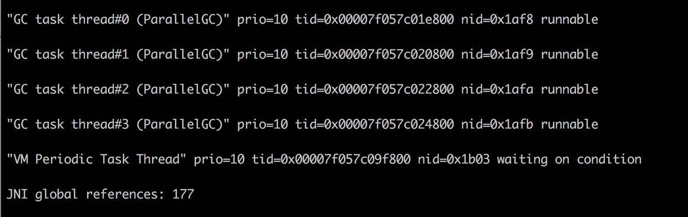

# JDk性能监控与调优工具

给一个系统定位问题的时候， 知识、 经验是关键基础， 数据是依据， 工具是运用知识处理数据的手段。 
这里说的数据包括：运行日志、 异常堆栈、 GC日志、 线程快照（ threaddump/javacore文件） 、 
堆转储快照（ heapdump/hprof文件） 等。 经常使用适当的虚拟机监控和分析的工具可以加快我们分析数据、 
定位解决问题的速度， 但在学习工具前， 也应当意识到工具永远都是知识技能的一层包装， 没有什么工具是“秘密武器”， 
不可能学会了就能包治百病。本博文将详细介绍的JDK性能监控与调优工具，帮助大家在测试与生产环境中更好的发现问题和解决问题。

# 一、JVMJDk性能监控与调优工具

## 1.1 jps:虚拟机进程状况工具

可以列出正在运行的虚拟机进程， 并显示虚拟机执行主类（ Main Class,main（） 函数所在的类）
名称以及这些进程的本地虚拟机唯一ID（ Local Virtual Machine Identifier,LVMID）。

```shell
jsp命令格式：
jps[options][hostid]

jps执行样例：
D： \Develop\Java\jdk1.6.0_21\bin＞ jps-l
2388 D： \Develop\glassfish\bin\..\modules\admin-cli.jar
2764 com.sun.enterprise.glassfish.bootstrap.ASMain
3788 sun.tools.jps.Jps
```

## 1.2 jstat 虚拟机统计信息监视工具

jstat（JVM Statistics Monitoring Tool）：用于监视虚拟机各种运行状态信息的命令行工具。
它可以显示本地或者远程虚拟机进程中的类装载、内存、垃圾收集、JIT 编译等运行数据。在没有GUI图形界面，
只提供了纯文本控制台环境的服务器上，它将是运行期定位虚拟机性能问题的首选工具。常用于检测垃圾回收问题以及内存泄漏问题。

```shell
基本使用语法为：jstat -<option> [-t] [-h<lines>] <vmid> [<interval> [<count>]]
查看命令相关参数：jstat-h 或 jstat-help
其中 vmid 是进程 id 号，也就是 jps 之后看到的前面的号码，如下：
```

## 1.3 jinfo Java配置信息工具

jinfo(Configuration Info for Java)：查看虚拟机配置参数信息，也可用于调整虚拟机的配置参数。
在很多情况卡，Java 应用程序不会指定所有的 Java 虚拟机参数。而此时，开发人员可能不知道某一个具体的
Java 虚拟机参数的默认值。在这种情况下，可能需要通过查找文档获取某个参数的默认值。
这个查找过程可能是非常艰难的。但有了 jinfo 工具，开发人员可以很方便地找到 Java 虚拟机参数的当前值。
```shell
基本使用语法为：jinfo [options] pid
jinfo 17800
```

## 1.4 jhsdb Java内存映像工具

稍微提一下 jmap 命令，它在 9 版本里被干掉了，取而代之的是 jhsdb，你可以像下面的命令一样使用。
heap 参数能够帮我们看到大体的内存布局，以及每一个年代中的内存使用情况。这和我们前面介绍的内存布局，
以及在 VisualVM 中看到的 没有什么不同。但由于它是命令行，所以使用更加广泛。

```shell
jhsdb jmap  --heap --pid  37340
jhsdb jmap  --pid  37288
jhsdb jmap  --histo --pid  37340
jhsdb jmap  --binaryheap --pid  37340
```

## 1.5 jhat 虚拟机堆转储快照分析工具

hat(JVM Heap Analysis Tool)：Sun JDK 提供的 jhat 命令与 jmap 命令搭配使用，用于分析jmap生成的 
heap dump 文件（堆转储快照）。jhat 内置了一个微型的 HTTP/HTML 服务器，生成 dump 文件的分析结果后，
用户可以在浏览器中查看分析结果（分析虚拟机转储快照信息）。

```shell
jmap -dump:live,file=a.log pid

除了使用jmap命令，还可以通过以下方式：
1、使用 jconsole 选项通过 HotSpotDiagnosticMXBean 从运行时获得堆转储（生成dump文件）、
2、虚拟机启动时如果指定了 -XX:+HeapDumpOnOutOfMemoryError 选项, 则在抛出 OutOfMemoryError 时, 会自动执行堆转储。
3、使用 hprof 命令
```

## 1.6 jstack Java堆栈跟踪工具

jstack（JVM Stack Trace）：用于生成虚拟机指定进程当前时刻的线程快照（虚拟机堆栈跟踪）。线程快照就是当前虚拟机内指定进程的每一条线程正在执行的方法堆栈的集合。

生成线程快照的作用：可用于定位线程出现长时间停顿的原因，如线程间死锁、死循环、请求外部资源导致的长时间等待等问题。这些都是导致线程长时间停顿的常见原因。
当线程出现停顿时，就可以用 jstack 显示各个线程调用的堆栈情况。

在 thread dump 中，要留意下面几种状态:
1. 死锁，Deadlock（重点关注）
2. 等待资源，Waiting on condition（重点关注）
3. 等待获取监视器，Waiting on monitor entry（重点关注）
4. 阻塞，Blocked（重点关注）
5. 执行中，Runnable
6. 暂停，Suspended
7. 对象等待中，Object.wait() 或 TIMED＿WAITING
8. 停止，Parked

```shell
jstack命令格式：
jstack[option]vmid
 
jstack [ option ] pid
jstack [ option ] executable core
jstack [ option ] [server-id@]remote-hostname-or-IP
```

# 二、JVM的内存问题

## 2.1 内存泄漏

再来看一个经常发生的内存泄漏的例子，也是由于 HashMap 产生的。代码如下，由于没有重写Key类的hashCode和equals方法，
造成了放入 HashMap 的所有对象都无法被取出来，它们和外界失联了。所以下面的代码结果是 null。
```java
//leak example
import java.util.HashMap;
import java.util.Map;

public class HashMapLeakDemo {
    public static class Key {
        String title;

        public Key(String title) {
            this.title = title;
        }
    }
    public static void main(String[] args) {
        Map<Key, Integer> map = new HashMap<>();

        map.put(new Key("1"), 1);
        map.put(new Key("2"), 2);
        map.put(new Key("3"), 2);

        Integer integer = map.get(new Key("2"));
        System.out.println(integer);
    }
}
```
即使提供了 equals 方法和 hashCode 方法，也要非常小心，尽量避免使用自定义的对象作为 Key。

再看一个例子，关于文件处理器的应用，在读取或者写入一些文件之后，由于发生了一些异常，
close 方法又没有放在 finally 块里面，造成了文件句柄的泄漏。由于文件处理十分频繁，产生了严重的内存泄漏问题。

另外，对 Java API 的一些不当使用，也会造成内存泄漏。很多同学喜欢使用 String 的 intern 方法，
但如果字符串本身是一个非常长的字符串， 而且创建之后不再被使用，则会造成内存泄漏。

```java
import java.util.UUID;

public class InternDemo {
    static String getLongStr() {
        StringBuilder sb = new StringBuilder();
        for (int i = 0; i < 100000; i++) {
            sb.append(UUID.randomUUID().toString());
        }
        return sb.toString();
    }

    public static void main(String[] args) {
        while (true) {
            getLongStr().intern();
        }
    }
}
```


## 2.2 系统卡顿

有一个关于服务的某个实例，经常发生服务卡顿。由于服务的并发量是比较高的，所以表现也非常明显。
这个服务和我们第 8 课时的高并发服务类似，每多停顿 1 秒钟，几万用户的请求就会感到延迟。

我们统计、类比了此服务其他实例的 CPU、内存、网络、I/O 资源，区别并不是很大，所以一度怀疑是机器硬件的问题。

接下来我们对比了节点的 GC 日志，发现无论是 Minor GC，还是 Major GC，这个节点所花费的时间，都比其他实例长得多。

通过仔细观察，我们发现在 GC 发生的时候，vmstat 的 si、so 飙升的非常严重，这和其他实例有着明显的不同。

使用 free 命令再次确认，发现 SWAP 分区，使用的比例非常高，引起的具体原因是什么呢？

更详细的操作系统内存分布，从 /proc/meminfo 文件中可以看到具体的逻辑内存块大小，有多达 40 项的内存信息，这些信息都可以通过遍历 /proc 目录的一些文件获取。
我们注意到 slabtop 命令显示的有一些异常，dentry（目录高速缓冲）占用非常高。

问题最终定位到是由于某个运维工程师执行了一句命令：
```shell
find / | grep "x"
```
他是想找一个叫做 x 的文件，看看在哪台服务器上，结果，这些老服务器由于文件太多，扫描后这些文件信息都缓存到了 slab 区上。而服务器开了 swap，
操作系统发现物理内存占满后，并没有立即释放 cache，导致每次 GC 都要和硬盘打一次交道。

解决方式就是关闭 SWAP 分区。swap 是很多性能场景的万恶之源，建议禁用。当你的应用真正高并发了，SWAP绝对能让你体验到它魔鬼性的一面：
进程倒是死不了了，但GC时间长的却让人无法忍受。

## 2.3 GC 引起 CPU 飙升

我们有个线上应用，单节点在运行一段时间后，CPU 的使用会飙升，一旦飙升，一般怀疑某个业务逻辑的计算量太大，
或者是触发了死循环（比如著名的 HashMap 高并发引起的死循环），但排查到最后其实是 GC 的问题。

在 Linux 上，分析哪个线程引起的 CPU 问题，通常有一个固定的步骤。我们下面来分解这个过程，这是面试频率极高的一个问题。 

1. 使用 top 命令，查找到使用 CPU 最多的某个进程，记录它的 pid。使用 Shift + P 快捷键可以按 CPU 的使用率进行排序。
```shell
top
```
2. 再次使用 top 命令，加 -H 参数，查看某个进程中使用 CPU 最多的某个线程，记录线程的 ID。
```shell
top -Hp $pid
```
3. 使用 printf 函数，将十进制的 tid 转化成十六进制。
```shell
printf %x $tid
```
4. 使用 jstack 命令，查看 Java 进程的线程栈。
```shell
jstack $pid >$pid.log
```
5. 使用 less 命令查看生成的文件，并查找刚才转化的十六进制 tid，找到发生问题的线程上下文。
```shell
less $pid.log
```

我们在 jstack 日志中找到了 CPU 使用最多的几个线程。



可以看到问题发生的根源，是我们的堆已经满了，但是又没有发生 OOM，于是 GC 进程就一直在那里回收，回收的效果又非常一般，造成 CPU 升高应用假死。
接下来的具体问题排查，就需要把内存 dump 一份下来，使用 MAT 等工具分析具体原因了.

