# JVM调优实战

# 摘要

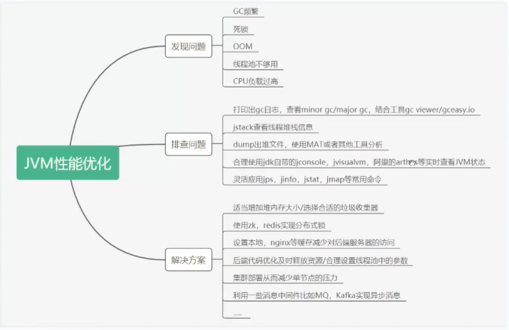

# 一、JVM调优常用命令

```shell
# 查询内存信息 实例个数以及内存大小
jps
```


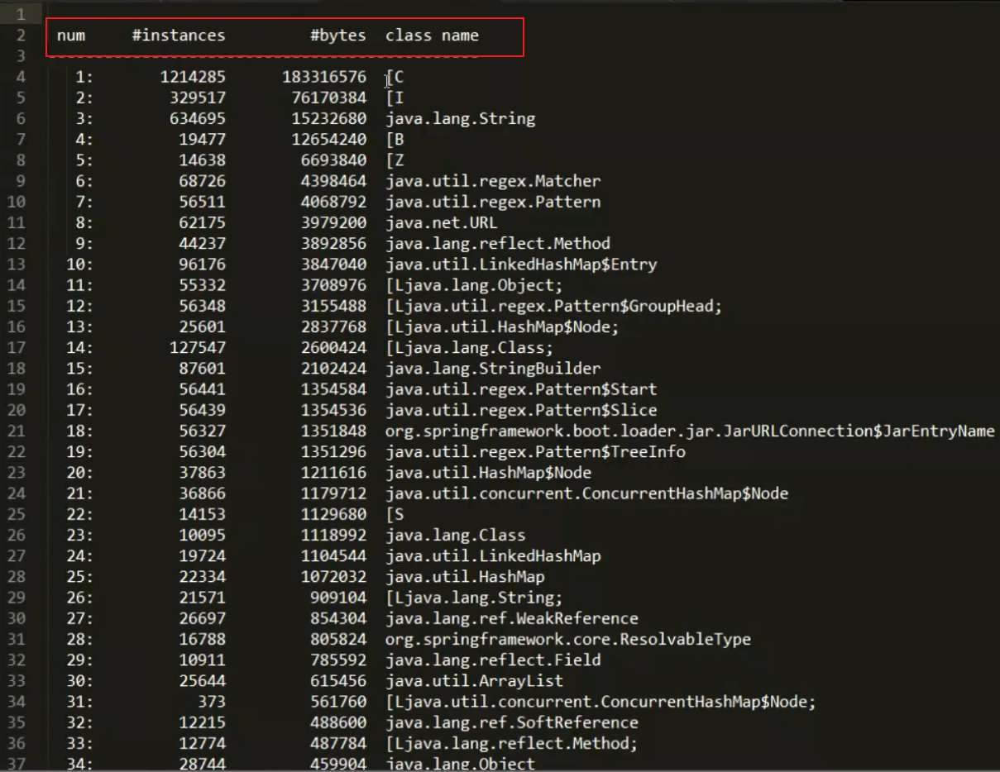

```shell
# 查询内存信息 实例个数以及内存大小
jmp
jmp -head ID号
```
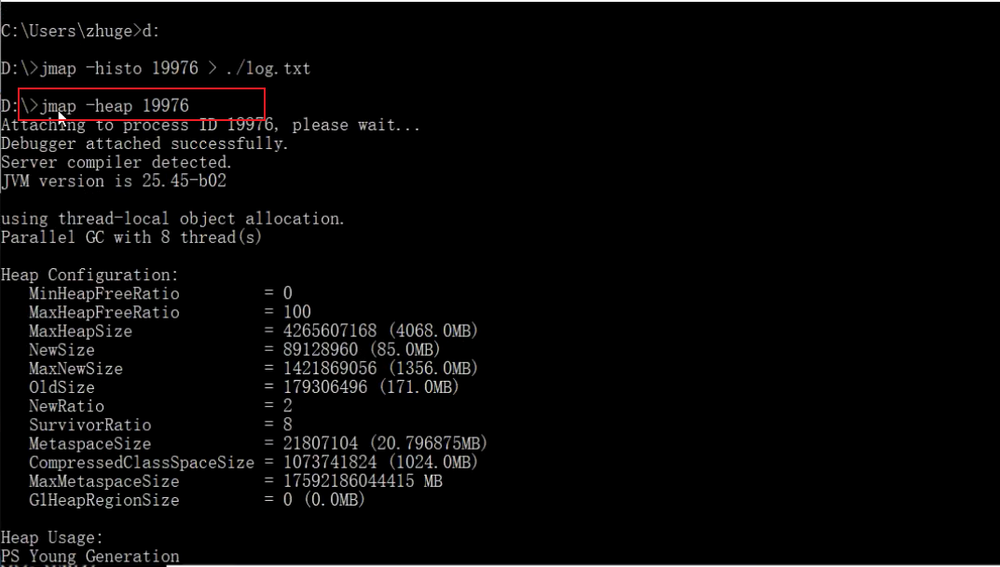

```shell
# 查询内存信息 实例个数以及内存大小
jmap
jmp -dunp:format=b,file=euraka hprof 19976
```
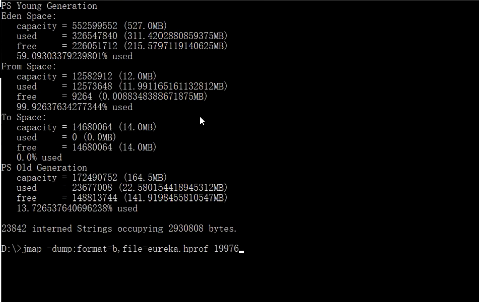

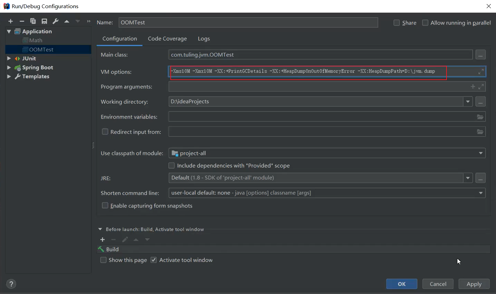

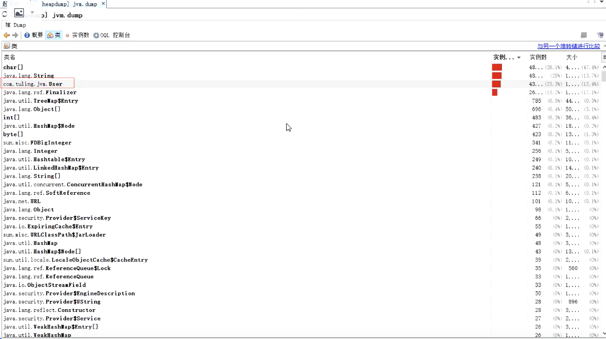

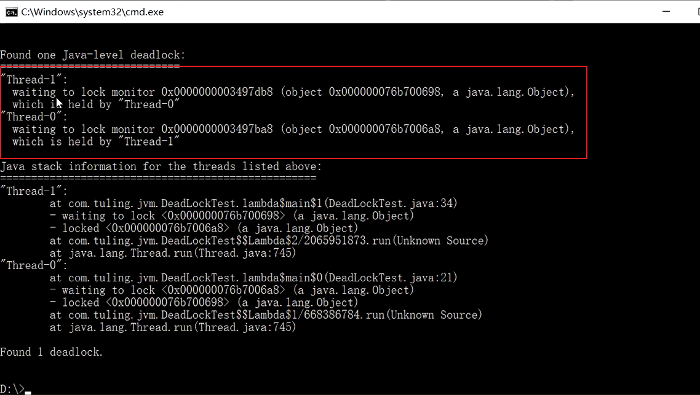

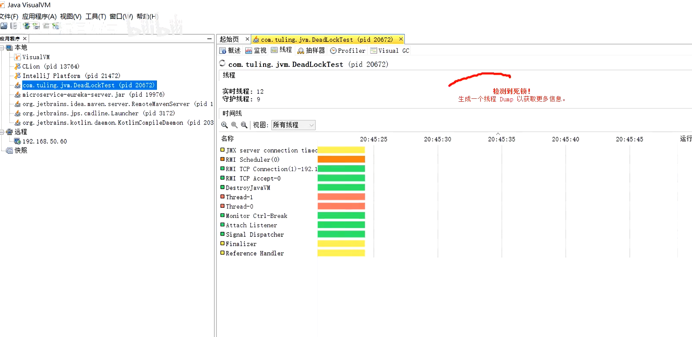

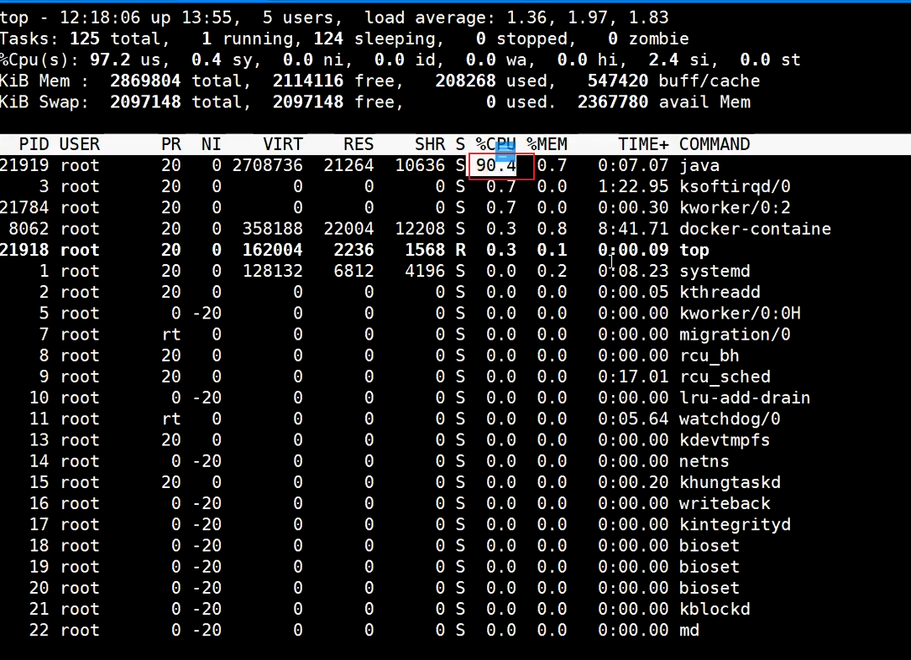

# 二、JVM的解决方案

## 2.1 CPU飙高

1. 先用top命令找出cpu占比最高的。


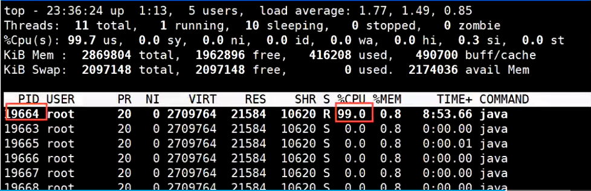

2. ps -ef或者jps进一步定位，得知是一个怎样的后台程序在给我们惹事。

3. ps -mp 进程 -o THREAD,tid,time 定位到具体的线程或者代码。

4. 将需要的线程id转化成16进制格式（英文小写格式）。

5. jstack 进程id | grep tid（十六进制线程id英文小写） -A60

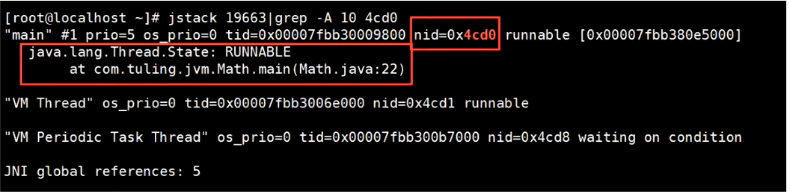

## 2.2 GC频繁问题
1. 首先用top命令，观察cpu占用情况，同时确定pid

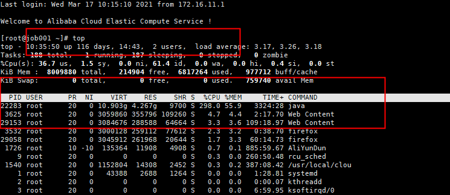

3. 查看该进程的gc状态  jstat -gc 22283   5000   ===每5 秒一次显示进程号为 12538的 java进成的 GC情况，结果如下图：

4. 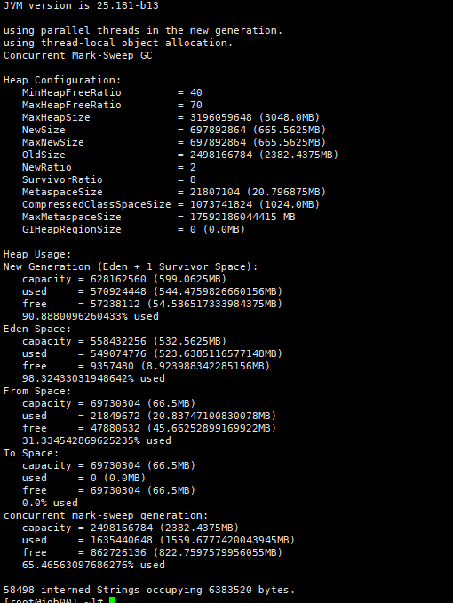

5. jmap -heap 22283 查看各个代的内存使用以及jvm 配置.

6. 查看对象情况，确定大对象，jmap -histo 22283 > /tmp/log1.txt           less   log1.text

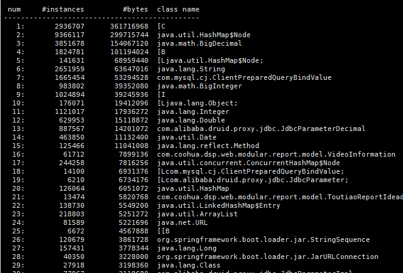

7. 导出整个JVM 中内存信息 jmap -dump:format=b,file=/tmp/log33.dump   22283  下载到本地

8. 利用以下工具进行分析: jhat是sun 1.6及以上版本中自带的一个用于分析JVM 堆DUMP 文件的工具，基于此工具可分析JVM HEAP 中对象的内存占用情况:jhat -J-Xmx1024M [file]

## 2.3 OOM内存溢出问题

1. 因为是偶发性的，所以第一次简单的认为就是堆内存不足导致，所以单方面的加大了堆内存从4G调整到8G。
2. 但是问题依然没有解决，只能从堆内存信息下手，通过开启了-XX:+HeapDumpOnOutOfMemoryError参数 获得堆内存的dump文件。
3. VisualVM对堆dump文件进行分析，通过VisualVM查看到占用内存最大的对象是String对象，本来想跟踪着String对象找到其引用的地方，但dump文件太大，跟踪进去的时候总是卡死，而String对象占用比较多也比较正常，最开始也没有认定就是这里的问题，于是就从线程信息里面找突破点。
4. 通过线程进行分析，先找到了几个正在运行的业务线程，然后逐一跟进业务线程看了下代码，发现有个引起我注意的方法，导出订单信息。
5. 因为订单信息导出这个方法可能会有几万的数据量，首先要从数据库里面查询出来订单信息，然后把订单信息生成excel，这个过程会产生大量的String对象。
6. 为了验证自己的猜想，于是准备登录后台去测试下，结果在测试的过程中发现到处订单的按钮前端居然没有做点击后按钮置灰交互事件，结果按钮可以一直点，因为导出订单数据本来就非常慢，使用的人员可能发现点击后很久后页面都没反应，结果就一直点，结果就大量的请求进入到后台，堆内存产生了大量的订单对象和EXCEL对象，而且方法执行非常慢，导致这一段时间内这些对象都无法被回收，所以最终导致内存溢出。
7. 知道了问题就容易解决了，最终没有调整任何JVM参数，只是在前端的导出订单按钮上加上了置灰状态，等后端响应之后按钮才可以进行点击，然后减少了查询订单信息的非必要字段来减少生成对象的体积，然后问题就解决了。

# 三、Java线上问题排查神器Arthas实战分析

## 3.1 Arthas使用背景

是不是在实际开发工作当中经常碰到自己写的代码在开发、测试环境行云流水稳得一笔，可一到线上就经常不是缺这个就是少那个反正就是一顿报错抽风似的，
线上调试代码又很麻烦，让人头疼得抓狂；而且debug不一定是最高效的方法，遇到线上问题不能debug了怎么办。
原先我们Java中我们常用分析问题一般是使用JDK自带或第三方的分析工具如jstat、jmap、jstack、 jconsole、visualvm、Java Mission Control、MAT等。
但此刻的你没有看错，还有一款神器Arthas工具着实让人吃惊，可帮助程序员解决很多繁琐的问题，使得加班解决线上问题成为过去的可能性大大提高。

## 3.2 Arthas简介

Arthas是一个Java诊断工具，由阿里巴巴中间件团队开源，目前已在Java开发人员中被广泛采用。Arthas能够分析，诊断，定位Java应用问题，
例如：JVM信息，线程信息，搜索类中的方法，跟踪代码执行，观测方法的入参和返回参数等等。并能在不修改应用代码的情况下，对业务问题进行诊断，
包括查看方法的出入参，异常，监测方法执行耗时，类加载信息等，大大提升线上问题排查效率。简单的话：就是再不重启应用的情况下达到排查问题的目的。

## 3.3 Arthas特性
- 仪表盘实时查看系统的运行状态。
- OGNL表达式查看参数和返回值/例外，查看方法参数、返回值和异常。
- 通过jad/sc/redefine实现在线热插拔。
- 快速解决类冲突问题，定位类加载路径。
- 快速定位应用热点和生成火焰图。
- 支持在线诊断WebConsole。
- Arthas对应用程序没有侵入(但对宿主机jvm有侵入)，代码或项目中不需要引入jar包或依赖，因为是通过attach的机制实现的，我们的应用的程序和arthas都是独立的进程，arthas是通过和jvm底层交互来获取运行在其上的应用程序实时数据的，灵活查看运行时的值，这个和hickwall,jprofiler等监控软件的区别(JPofiler也有这样的功能,但是是收费的)动态增加aop代理和监控日志功能，无需重启服务，而且关闭arthas客户端后会还原所有增强过的类，原则上是不会影响现有业务逻辑的。
- 对应用程序所在的服务器性能的影响，个别命令使用不当的话，可能会撑爆jvm内存或导致应用程序响应变慢，命令的输出太多，接口调用太频繁会记录过多的数据变量到内存里，比如tt指令，建议加 -n 参数 限制输出次数，sc * 通配符的使用不当，范围过大，使用异步任务时，请勿同时开启过多的后台异步命令，以免对目标JVM性能造成影响，一把双刃剑(它甚至可以修改jdk里的原生类)，所以在线上运行肯定是需要权限和流程控制的。

## 3.4 Arthas使用场景
在日常开发中，当我们发现应用的某个接口响应比较慢，这个时候想想要分析一下原因，找到代码中耗时的部分，比较容易想到的是在接口链路的IO操作上下游打印时间日志，
再根据几个时间点的日志算出耗时长的 IO 操作。这种方式没有问题，但是加日志需要发布，既繁琐又低效，这个时候可以引入一些线上 debug 的工具，
arthas 就是很好的一种，除了分析耗时，还可以打印调用栈、方法入参及返回，类加载情况，线程池状态，系统参数等等，其实现原理是解析JVM在操作系统中的文件，
大部分操作是只读的，对服务进程没有侵入性，因此可以放心使用。

## 3.5 Arthas实战

### 3.5.1 CPU占用高示例

```java
package cn.itxs;

import org.springframework.boot.SpringApplication;
import org.springframework.boot.autoconfigure.SpringBootApplication;
import java.util.UUID;
import java.util.concurrent.TimeUnit;

@SpringBootApplication
public class App 
{
    public static void main(String[] args) {
        SpringApplication.run(App.class,args);
        new Thread( () -> {
            while (true) {
                String str = UUID.randomUUID().toString().replaceAll("-", "");
            }
        },"cpu demo thread").start();

        new Thread( () -> {
            while (true) {
                String str = UUID.randomUUID().toString().replaceAll("-", "");
                try {
                    TimeUnit.MILLISECONDS.sleep(10);
                } catch (InterruptedException e) {
                    e.printStackTrace();
                }
            }
        },"cpu with sleep thread").start();
    }
}
```

```shell
# 下载`arthas-boot.jar`这种也是官方推荐的方式
curl -O https://arthas.aliyun.com/arthas-boot.jar
# 启动arthas-boot.jar，必须启动至少一个 java程序，否则会自动退出。运行此命令会自动发现 java进程，输入需要 attach 进程对应的序列号，例如，输入1按回车则会监听该进程。
java -jar arthas-boot.jar
# 比如输入JVM （jvm实时运行状态，内存使用情况等）
```
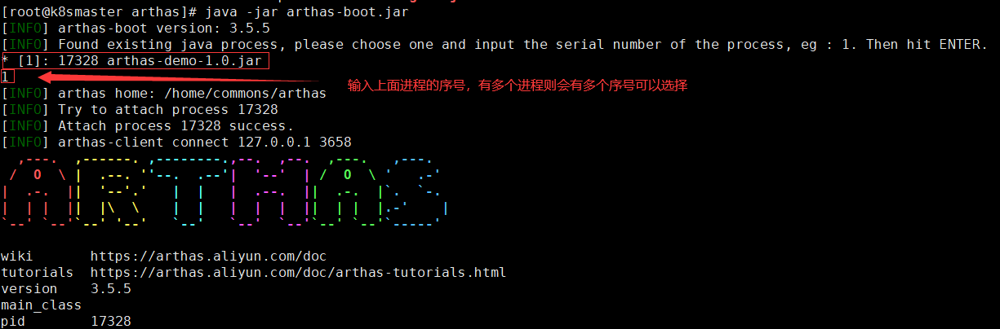

### 3.5.1 死锁
```java
import org.springframework.web.bind.annotation.RequestMapping;
import org.springframework.web.bind.annotation.ResponseBody;
import org.springframework.web.bind.annotation.RestController;

import java.util.concurrent.TimeUnit;

@RestController
@RequestMapping("/thread")
public class ThreadController {
    private Object obj1 = new Object();
    private Object obj2 = new Object();

    @RequestMapping("/test")
    @ResponseBody
    public String test(){
        new Thread(() -> {
            synchronized (obj1){
                try {
                    TimeUnit.SECONDS.sleep(10);
                } catch (InterruptedException e) {
                    synchronized (obj2){
                        System.out.printf("thread 1执行到此");
                    }
                }
            }
        },"thread 1").start();

        new Thread(() -> {
            synchronized (obj2) {
                synchronized (obj1){
                    System.out.printf("thread 2执行到此");
                }
            }
        },"thread 2").start();
        return "thread test";
    }
}
------------------------------------------------------------------------------------------------------------
import org.springframework.boot.SpringApplication;
import org.springframework.boot.autoconfigure.SpringBootApplication;

@SpringBootApplication
public class App
{
    public static void main(String[] args) {
        SpringApplication.run(App.class,args);
    }
}
```
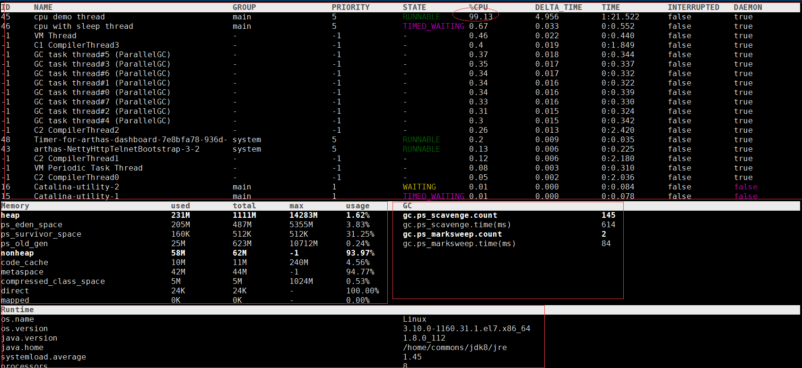

- 第一部分时显示JVM中运行的所有线程：所在线程组，优先级，线程的状态，CPU的占有率，是否是后台进程等。
- 第二部分显示的JVM内存的使用情况和GC的信息。
- 第三部分是操作系统的一些信息和 Java版本号。

```shell
# 当前最忙的前N个线程 thread -b, ##找出当前阻塞其他线程的线程 thread -n 5 -i 1000 #间隔一定时间后展示，本例中可以看到最忙CPU线程为id=45，代码行数为19
thread -n 5
# jad查看反编译的代码
jad cn.itxs.controller.CpuController
```

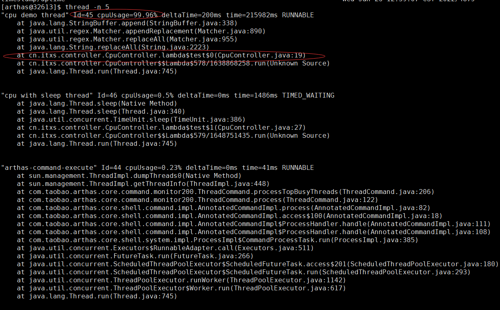

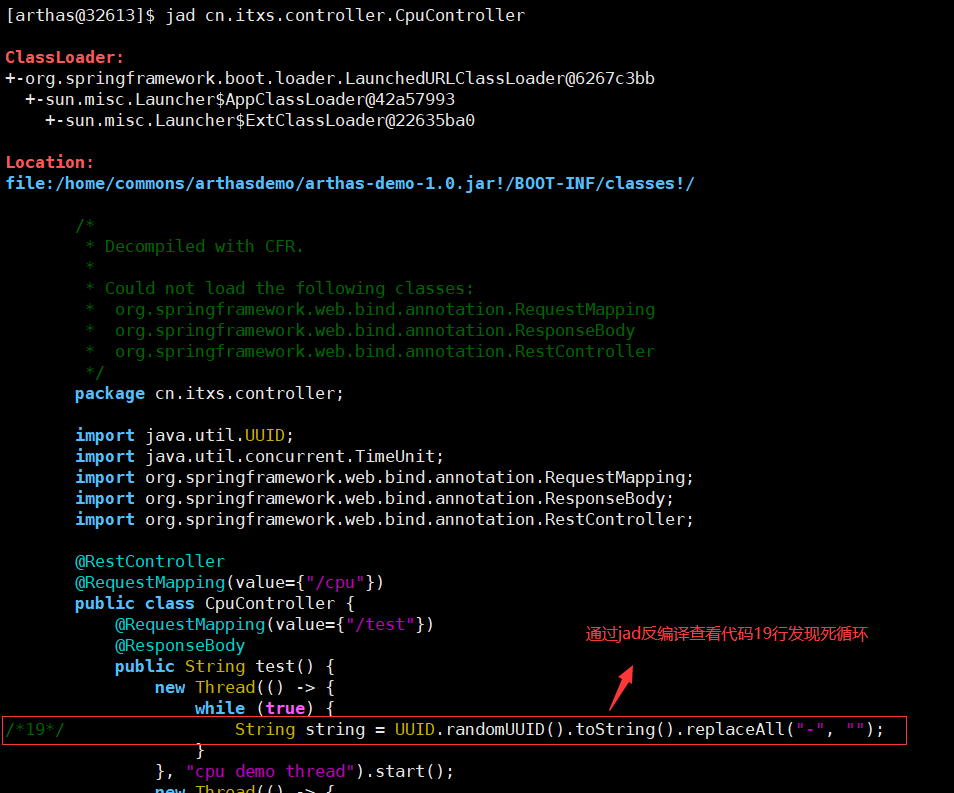

```java
package cn.itxs.controller;

import org.springframework.web.bind.annotation.RequestMapping;
import org.springframework.web.bind.annotation.ResponseBody;
import org.springframework.web.bind.annotation.RestController;
import java.util.concurrent.TimeUnit;

@RestController
@RequestMapping("/thread")
public class ThreadController {
    private Object obj1 = new Object();
    private Object obj2 = new Object();

    @RequestMapping("/test")
    @ResponseBody
    public String test(){
        new Thread(() -> {
            synchronized (obj1){
                try {
                    TimeUnit.SECONDS.sleep(10);
                } catch (InterruptedException e) {
                }
                synchronized (obj2){
                    System.out.println("thread 1执行到此");
                }
            }
        },"thread 1").start();
        try {
            TimeUnit.SECONDS.sleep(2);
        } catch (InterruptedException e) {
            e.printStackTrace();
        }
        new Thread(() -> {
            synchronized (obj2) {
                synchronized (obj1){
                    System.out.println("thread 2执行到此");
                }
            }
        },"thread 2").start();
        return "thread test";
    }
}
```
```shell
# 启动SpringBoot演示程序，访问页面http://192.168.50.100:8080/thread/test
# 运行arthas，查看线程
thread
```

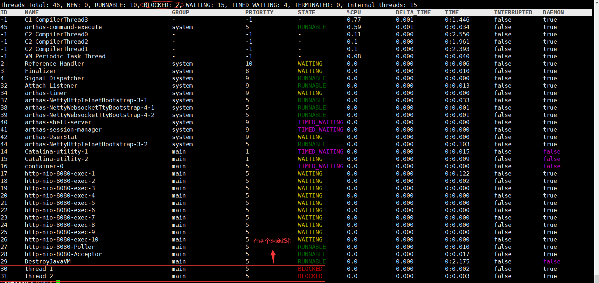

```shell
# 查看阻塞线程
thread -b
# jad反编译查看代码
jad --source-only cn.itxs.controller.ThreadController
```

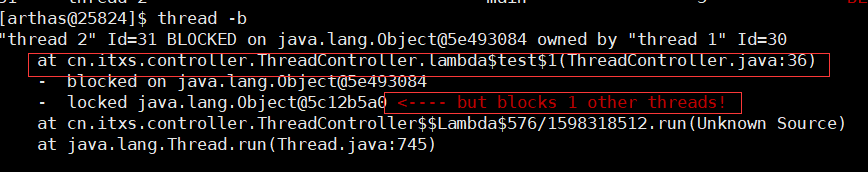
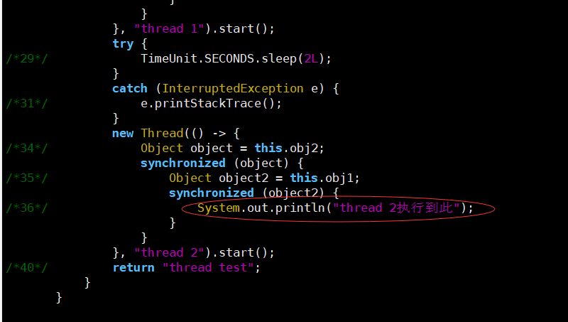

# 博文参考
- https://www.jianshu.com/p/d8194e39e1db
- https://blog.csdn.net/qq_20949471/article/details/122738529
- http://arthas.gitee.io/
- https://arthas.gitee.io/quick-start.html
- https://arthas.gitee.io/advanced-use.html