# DDD系统的设计的原理

DDD 分层架构包含用户接口层、应用层、领域层和基础层。通过这些层次划分，我们可以明确微服务各层的职能，划定各领域对象的边界，确定各领域对象的协作方式。
DDD的分层架构如图：从上到下依次是：用户接口层、应用层、领域层和基础层。

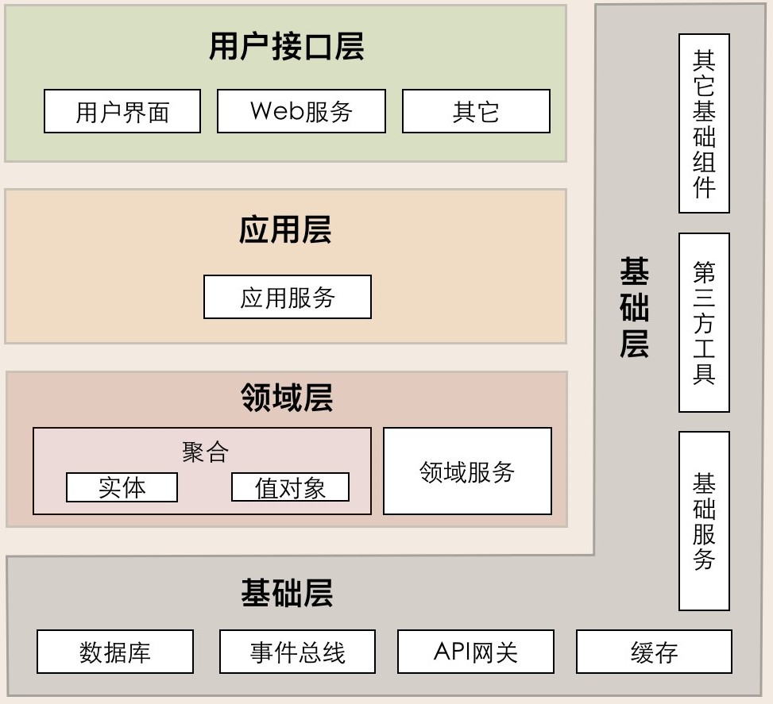

## 服务的调用

微服务的服务调用包括三类主要场景：微服务内跨层服务调用，微服务之间服务调用和领域事件驱动。

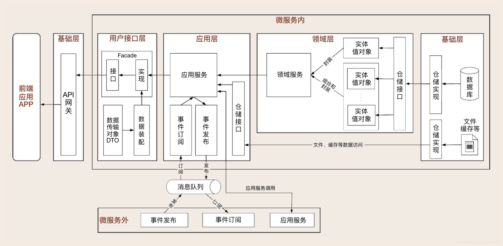

## 用户接口层

用户接口层负责向用户显示信息和解释用户指令，并将数据传递给 Application 层。
数据的组装、数据传输格式以及 Facade 接口等代码都会放在这一层目录里。
这里的用户可能是：用户、程序、自动化测试和批处理脚本等等。

## 应用层

实现服务组合和编排，适应业务流程快速变化的需求，这一层聚集了应该服务和事件相关的功能。
应用层是很薄的一层，理论上不应该有业务规则或逻辑，主要面向用例和流程相关的操作。但应用层又位于领域层之上，
因为领域层包含多个聚合，所以它可以协调多个聚合的服务和领域对象完成服务编排和组合，协作完成业务操作。
此外，应用层也是微服务之间交互的通道，它可以调用其它微服务的应用服务，完成微服务之间的服务组合和编排。

特别注意：这里我要提醒你一下：在设计和开发时，不要将本该放在领域层的业务逻辑放到应用层中实现。
因为庞大的应用层会使领域模型失焦，时间一长你的微服务就会演化为传统的三层架构，业务逻辑会变得混乱。

## 领域层

实现领域的核心业务逻辑。这一层聚集了领域模型的聚合、聚合根、实体、值对象、领域服务和事件等领域对象，以及它们组合所形成的业务能力。
领域模型的业务逻辑主要是由实体和领域服务来实现的，其中，实体采用充血模式，其自身的所有逻辑都写在本类中；
当需要组合多个实体或值对象时，领域服务就会出马，实现复杂的业务逻辑。

## 基础层

基础层是贯穿所有层的，它的作用就是为其它各层提供通用的技术和基础服务，包括第三方工具、驱动、消息中间件、网关、文件、缓存以及数据库等。
比较常见的功能还是提供数据库持久化。基础层包含基础服务，它采用依赖倒置设计，封装基础资源服务，实现应用层、领域层与基础层的解耦，降低外部资源变化对应用的影响。
比如说，在传统架构设计中，由于上层应用对数据库的强耦合，很多公司在架构演进中最担忧的可能就是换数据库了，因为一旦更换数据库，
就可能需要重写大部分的代码，这对应用来说是致命的。那采用依赖倒置的设计以后，应用层就可以通过解耦来保持独立的核心业务逻辑。
当数据库变更时，我们只需要更换数据库基础服务就可以了，这样就将资源变更对应用的影响降到了最低。

# DDD设计代码模型
其实DDD并没有标准的代码模型，最多只能说是给出了建议模板，在实际的架构设计中，不同人有不同的理解，设计出来的结构就不相同，
也可以根据公司和业务的情况做适当的调整。以下的文件目录名不是固定的，可以修改，但是一定要有意义，且起名要比较贴切。
如下图，在代码模型里分别为用户接口层、应用层、领域层和基础层，建立了 interfaces、application、domain 和 infrastructure 四个一级代码目录。

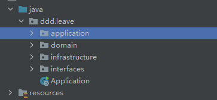

## 用户接口层
我这里提供了两种风格供选择，可以根据具体项目情况选择一种合适或者你喜欢的。

**风格一**

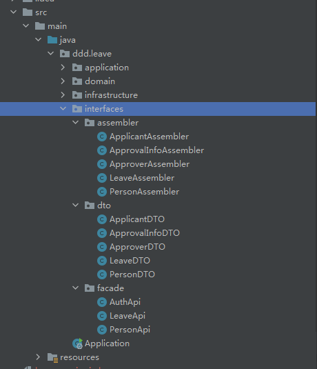

- Assembler: 实现 DTO 与领域对象之间的相互转换和数据交换。一般来说 Assembler 与 DTO 总是一同出现。
- Dto: 它是数据传输的载体，内部不存在任何业务逻辑，我们可以通过 DTO 把内部的领域对象与外界隔离。
- Facade: 提供较粗粒度的调用接口，将用户请求委托给一个或多个应用服务进行处理。

**风格二**

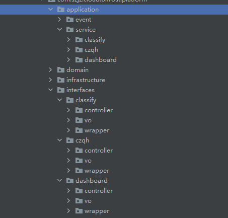

- controller： 提供较粗粒度的调用接口，将用户请求委托给一个或多个应用服务进行处理。
- vo: 它是数据传输的载体，内部不存在任何业务逻辑，我们可以根据项目需要，看是否要引入VO,PO,DTO,DO。
- **wrapper: ** 提供VO,PO,DTO,DO之间的相互转换和数据交换。

风格二也有缺点，就是应用层是允许跨领域、跨界限上下文、甚至是跨服务调用的，所以会导致有些接口不太好定义是属于哪个界限上下文的，
对于这种真的不好定义是哪个界限上下文，我们可以选择再新建一个目录来处理，全凭各位灵活选择。
但是一旦选择了某种风格就不要和其他风格混合使用，否则会导致项目结构混乱，不好维护。

## 应用层

如下图应用层有两个大目录：和上面接口层的两种风格对应，应用我也提供了两种风格。

**风格一**

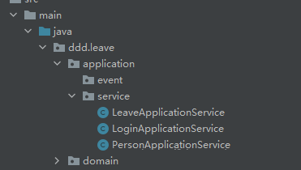

**风格二**

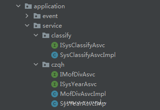

### Event（事件）

这层目录主要存放事件相关的代码。它包括两个子目录：publish 和 subscribe。前者主要存放事件发布相关代码，
后者主要存放事件订阅相关代码（事件处理相关的核心业务逻辑在领域层实现）。

这里提示一下：虽然应用层和领域层都可以进行事件的发布和处理，但为了实现事件的统一管理，
我建议你将微服务内所有事件的发布和订阅的处理都统一放到应用层，事件相关的核心业务逻辑实现放在领域层。
通过应用层调用领域层服务，来实现完整的事件发布和订阅处理流程。

### Service（应用服务）

这层的服务是应用服务。应用服务会对多个领域服务或外部应用服务进行封装、编排和组合，对外提供粗粒度的服务。
应用服务主要实现服务组合和编排，是一段独立的业务逻辑。你可以将所有应用服务放在一个文件里，
也可以把每个应用服务都单独放到一个文件夹中，以防应用服务类代码量过大。

## 领域层

Domain 是由一个或多个聚合包构成，共同实现领域模型的核心业务逻辑。聚合内的代码模型是标准和统一的，
包括：entity、event、repository 和 service 四个子目录。

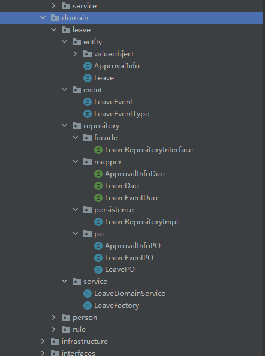

- 聚合目录： 它是聚合软件包的根目录，可以根据实际项目的聚合名称命名，比如权限聚合。在聚合内定义聚合根、实体和值对象以及领域服务之间的关系和边界。
- 聚合内实现高内聚的业务逻辑，它的代码可以独立拆分为微服务。
- 以聚合为单位的代码放在一个包里的主要目的是为了业务内聚，而更大的目的是为了以后微服务之间聚合的重组。
- 聚合之间清晰的代码边界，可以让你轻松地实现以聚合为单位的微服务重组，在微服务架构演进中有着很重要的作用。

- Event（事件）： 它存放事件实体以及与事件活动相关的业务逻辑代码。

- Service（领域服务）： 它存放领域服务代码。一个领域服务是多个实体组合出来的一段业务逻辑。你可以将聚合内所有领域服务都放在一个领域服务类中，
- 你也可以把每一个领域服务设计为一个类。如果领域服务内的业务逻辑相对复杂，我建议你将一个领域服务设计为一个领域服务类，
- 避免由于所有领域服务代码都放在一个领域服务类中，而出现代码臃肿的问题。领域服务封装多个实体或方法后向上层提供应用服务调用。

- Repository（仓储）： 它存放所在聚合的查询或持久化领域对象的代码，通常包括仓储接口和仓储实现方法。为了方便聚合的拆分和组合，
- 我们设定了一个原则：一个聚合对应一个仓储。

> 特别说明：按照 DDD 分层架构，仓储实现本应该属于基础层代码，但为了在微服务架构演进时，保证代码拆分和重组的便利性，
> 我是把聚合仓储实现的代码放到了聚合包内。这样，如果需求或者设计发生变化导致聚合需要拆分或重组时，
> 我们就可以将包括核心业务逻辑和仓储代码的聚合包整体迁移，轻松实现微服务架构演进。

如果是按照DDD分层架构来的话，Repository目录下酒只有一个Repository接口，其他内容就都要放到基础层中，如下图：

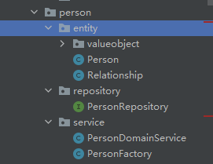

## 基础层

如下图，Infrastructure 的代码目录结构有：config 和common和 util 三个子目录。

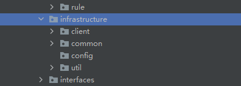

- client: 存放夸服务接口。
- Config： 主要存放配置相关代码。
- common: 一般存放消息、数据库、缓存、文件、总线、网关、公用的常量、方法、枚举等。

如果上文中把仓储的实现放到基础层来，那么common的文件结构如下：

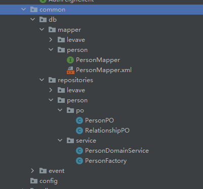

如果把仓储实现放到领域层中，则common没有db文件夹。
Util: 主要存放平台、开发框架、第三方类库、通用算法等基础代码，你可以为不同的资源类别建立不同的子目录。

# VO、DTO、DO、PO的概念

- VO（View Object）： 视图对象，用于展示层，它的作用是把某个指定页面（或组件）的所有数据封装起来。

- DTO（Data Transfer Object）： 数据传输对象，这个概念来源于J2EE的设计模式，原来的目的是为了EJB的分布式应用提供粗粒度的数据实体，
- 以减少分布式调用的次数，从而提高分布式调用的性能和降低网络负载，但在这里，我泛指用于展示层与服务层之间的数据传输对象。

- DO（Domain Object）： 领域对象，就是从现实世界中抽象出来的有形或无形的业务实体。

- PO（Persistent Object）： 持久化对象，它跟持久层（通常是关系型数据库）的数据结构形成一一对应的映射关系，如果持久层是关系型数据库，
- 那么，数据表中的每个字段（或若干个）就对应PO的一个（或若干个）属性。

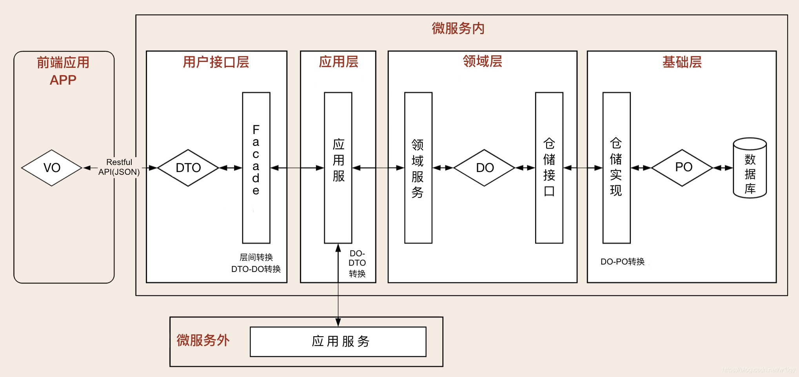