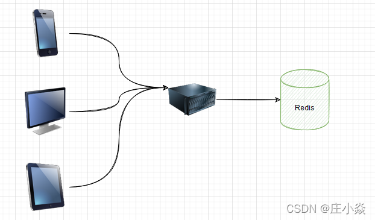
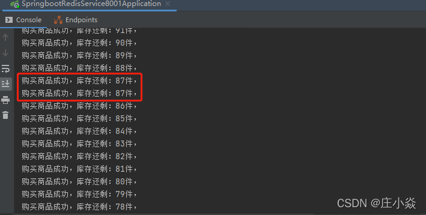
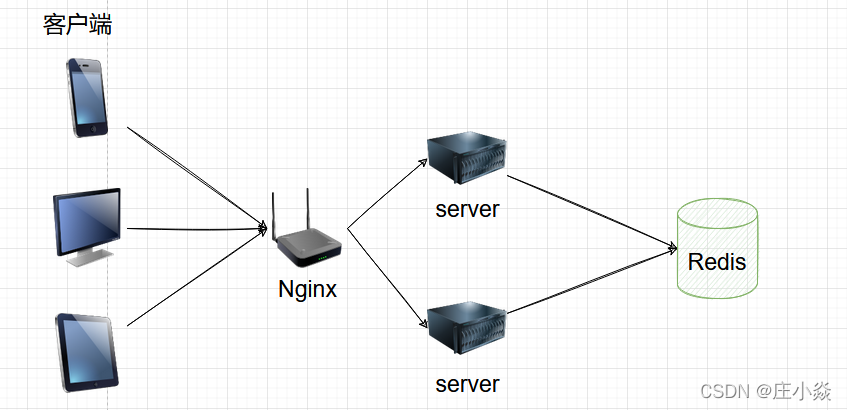
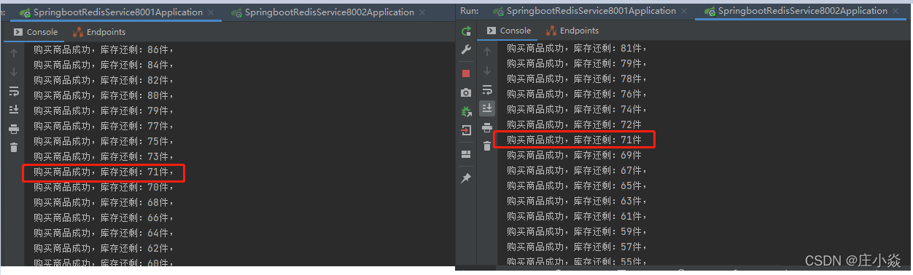

# 分布式锁的解决方案

# 摘要
目前几乎很多大型网站及应用都是分布式部署的，分布式场景中的数据一致性问题一直是一个比较重要的话题。
分布式的CAP理论告诉我们“任何一个分布式系统都无法同时满足一致性（Consistency）、可用性（Availability）和分区容错性（Partition tolerance），
最多只能同时满足两项。”所以，很多系统在设计之初就要对这三者做出取舍。在互联网领域的绝大多数的场景中，都需要牺牲强一致性来换取系统的高可用性，
系统往往只需要保证“最终一致性”，只要这个最终时间是在用户可以接受的范围内即可。

在很多场景中，我们为了保证数据的最终一致性，需要很多的技术方案来支持，比如分布式事务、分布式锁等。
有的时候，我们需要保证一个方法在同一时间内只能被同一个线程执行。在单机环境中，Java中其实提供了很多并发处理相关的API，
但是这些API在分布式场景中就无能为力了。也就是说单纯的Java Api并不能提供分布式锁的能力。所以针对分布式锁的实现目前有多种方案。

# 一、 分布式锁实现方式
锁是一种常用的并发控制机制，用于保证一项资源在任何时候只能被一个线程使用，如果其他线程也要使用同样的资源，必须排队等待上一个线程使用完。

锁指的是程序级别的锁，例如 Java 语言中的 synchronized 和 ReentrantLock 在单应用中使用不会有任何问题，
但如果放到分布式环境下就不适用了，这个时候我们就要使用分布式锁。分布式锁比较好理解就是用于分布式环境下并发控制的一种机制，
用于控制某个资源在同一时刻只能被一个应用所使用。如下所示：

分布式锁比较常见的实现方式有三种：
1. 基于Memcached实现的分布式锁：使用add命令，添加成功的情况下，表示创建分布式锁成功。
2. 基于数据库分布式锁实现。
3. 基于Redis实现的分布式锁。
4. 基于ZooKeeper实现的分布式锁：使用ZooKeeper顺序临时节点来实现分布式锁。

# 二、基于Memcached实现的分布式锁


# 三、基于数据库分布式锁实现

## 3.1 基于数据悲观锁的锁
要实现分布式锁，最简单的方式可能就是直接创建一张锁表，然后通过操作该表中的数据来实现了。
当我们要锁住某个方法或资源时，我们就在该表中增加一条记录，想要释放锁的时候就删除这条记录。 

创建这样一张数据库表： 
```mysql
CREATE TABLE `methodLock` (
  `id` int(11) NOT NULL AUTO_INCREMENT COMMENT '主键',
  `method_name` varchar(64) NOT NULL DEFAULT '' COMMENT '锁定的方法名',
  `desc` varchar(1024) NOT NULL DEFAULT '备注信息',
  `update_time` timestamp NOT NULL DEFAULT CURRENT_TIMESTAMP ON UPDATE CURRENT_TIMESTAMP COMMENT '保存数据时间，自动生成',
  PRIMARY KEY (`id`),
  UNIQUE KEY `uidx_method_name` (`method_name`) USING BTREE
) ENGINE=InnoDB DEFAULT CHARSET=utf8 COMMENT='锁定中的方法';
```
当我们想要锁住某个方法时，执行以下SQL： 
```mysql
insert into methodLock(method_name,desc) values (‘method_name’,‘desc’) 
```
因为我们对method_name做了唯一性约束，这里如果有多个请求同时提交到数据库的话，数据库会保证只有一个操作可以成功，
那么我们就可以认为操作成功的那个线程获得了该方法的锁，可以执行方法体内容。

当方法执行完毕之后，想要释放锁的话，需要执行以下Sql:
```mysql
delete from methodLock where method_name ='method_name'
```
上面这种简单的实现有以下几个问题：
1. 这把锁强依赖数据库的可用性，数据库是一个单点，一旦数据库挂掉，会导致业务系统不可用。
2. 这把锁没有失效时间，一旦解锁操作失败，就会导致锁记录一直在数据库中，其他线程无法再获得到锁。
3. 这把锁只能是非阻塞的，因为数据的insert操作，一旦插入失败就会直接报错。没有获得锁的线程并不会进入排队队列，要想再次获得锁就要再次触发获得锁操作。
4. 这把锁是非重入的，同一个线程在没有释放锁之前无法再次获得该锁。因为数据中数据已经存在了。

当然，我们也可以有其他方式解决上面的问题。

1. 数据库是单点？搞两个数据库，数据之前双向同步。一旦挂掉快速切换到备库上。 
2. 没有失效时间？只要做一个定时任务，每隔一定时间把数据库中的超时数据清理一遍。 
3. 非阻塞的？搞一个while循环，直到insert成功再返回成功。 
4. 非重入的？在数据库表中加个字段，记录当前获得锁的机器的主机信息和线程信息，那么下次再获取锁的时候先查询数据库，如果当前机器的主机信息和线程信息在数据库可以查到的话，直接把锁分配给他就可以了。

## 3.2 基于数据库排他锁
除了可以通过增删操作数据表中的记录以外，其实还可以借助数据中自带的锁来实现分布式的锁。
创建这样一张数据库表：
```mysql
CREATE TABLE `methodLock` (
  `id` int(11) NOT NULL AUTO_INCREMENT COMMENT '主键',
  `method_name` varchar(64) NOT NULL DEFAULT '' COMMENT '锁定的方法名',
  `desc` varchar(1024) NOT NULL DEFAULT '备注信息',
  `update_time` timestamp NOT NULL DEFAULT CURRENT_TIMESTAMP ON UPDATE CURRENT_TIMESTAMP COMMENT '保存数据时间，自动生成',
  PRIMARY KEY (`id`),
  UNIQUE KEY `uidx_method_name` (`method_name`) USING BTREE
) ENGINE=InnoDB DEFAULT CHARSET=utf8 COMMENT='锁定中的方法';
```
我们还用刚刚创建的那张数据库表。可以通过数据库的排他锁来实现分布式锁。 基于MySql的InnoDB引擎，可以使用以下方法来实现加锁操作：
```java
public boolean lock(){
    connection.setAutoCommit(false)
    while(true){
        try{
            result = select * from methodLock where method_name=xxx for update;
            if(result==null){
                return true;
            }
        }catch(Exception e){

        }
        sleep(1000);
    }
    return false;
}
```
在查询语句后面增加for update，数据库会在查询过程中给数据库表增加排他锁（这里再多提一句，InnoDB引擎在加锁的时候，
只有通过索引进行检索的时候才会使用行级锁，否则会使用表级锁。这里我们希望使用行级锁，就要给method_name添加索引，值得注意的是，这个索引一定要创建成唯一索引，
否则会出现多个重载方法之间无法同时被访问的问题。重载方法的话建议把参数类型也加上。）。当某条记录被加上排他锁之后，其他线程无法再在该行记录上增加排他锁。 

我们可以认为获得排它锁的线程即可获得分布式锁，当获取到锁之后，可以执行方法的业务逻辑，执行完方法之后，再通过以下方法解锁：
```java
public void unlock(){
    connection.commit();
}
```
通过connection.commit()操作来释放锁。这种方法可以有效的解决上面提到的无法释放锁和阻塞锁的问题。

阻塞锁？ for update语句会在执行成功后立即返回，在执行失败时一直处于阻塞状态，直到成功。
锁定之后服务宕机，无法释放？使用这种方式，服务宕机之后数据库会自己把锁释放掉。

**但是还是无法直接解决数据库单点和可重入问题。**

1. 这里还可能存在另外一个问题，虽然我们对method_name 使用了唯一索引，并且显示使用for update来使用行级锁。
但是，MySql会对查询进行优化，即便在条件中使用了索引字段，但是否使用索引来检索数据是由 MySQL 通过判断不同执行计划的代价来决定的，
如果 MySQL认为全表扫效率更高，比如对一些很小的表，它就不会使用索引，这种情况下InnoDB 将使用表锁，而不是行锁。如果发生这种情况就悲剧了。
2. 还有一个问题，就是我们要使用排他锁来进行分布式锁的lock，那么一个排他锁长时间不提交，就会占用数据库连接。一旦类似的连接变得多了，就可能把数据库连接池撑爆

## 3.3 基于数据库的分布式锁

总结一下使用数据库来实现分布式锁的方式，这两种方式都是依赖数据库的一张表，
- 一种是通过表中的记录的存在情况确定当前是否有锁存在，
- 一种是通过数据库的排他锁来实现分布式锁。

数据库实现分布式锁的优点

- 直接借助数据库，容易理解。

数据库实现分布式锁的缺点

- 会有各种各样的问题，在解决问题的过程中会使整个方案变得越来越复杂。
- 操作数据库需要一定的开销，性能问题需要考虑。
- 使用数据库的行级锁并不一定靠谱，尤其是当我们的锁表并不大的时候。 

# 四、基于Redis实现的分布式锁

## 4.1 单机架构下的数据一致性问题
场景描述：客户端模拟购买商品过程，在Redis中设定库存总数剩100个，多个客户端同时并发购买。



```java
package com.zhuangxiaoyan.springbootredis.controller;

import org.springframework.beans.factory.annotation.Autowired;
import org.springframework.data.redis.core.StringRedisTemplate;
import org.springframework.web.bind.annotation.RequestMapping;
import org.springframework.web.bind.annotation.RestController;
/**
* @description
* 最简单的情况，没有加任何的考虑，
* 即使是单体应用，并发情况下数据一致性都有问题
* @param: null
* @date: 2022/4/9 21:25
* @return:
* @author: xjl
*/

@RestController
public class NoneController {

@Autowired
StringRedisTemplate template;

@RequestMapping("/buy")
public String index() {
// Redis中存有goods:001号商品，数量为100  相当于是的redis中的get("goods")的操作。
String result = template.opsForValue().get("goods");
// 获取到剩余商品数
int total = result == null ? 0 : Integer.parseInt(result);
if (total > 0) {
               // 剩余商品数大于0 ，则进行扣减
int realTotal = total - 1;
// 将商品数回写数据库  相当于设置新的值的结果
template.opsForValue().set("goods", String.valueOf(realTotal));
System.out.println("购买商品成功，库存还剩：" + realTotal + "件");
return "购买商品成功，库存还剩：" + realTotal + "件";
} else {
System.out.println("购买商品失败");
}
return "购买商品失败";
}
}
```
使用Jmeter模拟高并发场景，测试结果如下：


测试结果出现多个用户购买同一商品，发生了数据不一致问题！解决办法：单体应用的情况下，对并发的操作进行加锁操作，保证对数据的操作具有原子性
```java
package com.zhuangxiaoyan.springbootredis.controller;
 
import org.springframework.beans.factory.annotation.Autowired;
import org.springframework.data.redis.core.StringRedisTemplate;
import org.springframework.web.bind.annotation.RequestMapping;
import org.springframework.web.bind.annotation.RestController;
 
import java.util.concurrent.locks.Lock;
import java.util.concurrent.locks.ReentrantLock;
 
/**
 * @description 单体应用的情况下，对并发的操作进行加锁操作，保证对数据的操作具有原子性
 * 1. synchronized
 * 2. ReentrantLock
 * 这种情况下，不会产生并发问题
 * @param: null
 * @date: 2022/4/9 21:25
 * @return:
 * @author: xjl
 */
@RestController
public class ReentrantLockController {
    // 引入的ReentrantLock 锁机制
    Lock lock = new ReentrantLock();
 
    @Autowired
    StringRedisTemplate template;
 
    @RequestMapping("/buy")
    public String index() {
        // 加锁
        lock.lock();
        try {
            // Redis中存有goods:001号商品，数量为100  相当于是的redis中的get("goods")的操作。
            String result = template.opsForValue().get("goods");
            // 获取到剩余商品数
            int total = result == null ? 0 : Integer.parseInt(result);
            if (total > 0) {
                int realTotal = total - 1;
                // 将商品数回写数据库  相当于设置新的值的结果
                template.opsForValue().set("goods", String.valueOf(realTotal));
                System.out.println("购买商品成功，库存还剩：" + realTotal + "件");
                return "购买商品成功，库存还剩：" + realTotal + "件";
            } else {
                System.out.println("购买商品失败");
            }
        } catch (Exception e) {
            //解锁
            lock.unlock();
        } finally {
            //解锁
            lock.unlock();
        }
        return "购买商品失败";
    }
}
```

## 4.2 分布式数据一致性问题

上面解决了单体应用的数据一致性问题，但如果是分布式架构部署呢，架构如下：提供两个服务，端口分别为8001、8002，连接同一个Redis服务，在服务前面有一台Nginx作为负载均衡。两台服务代码相同，只是端口不同。



将8001、8002两个服务启动，每个服务依然用ReentrantLock加锁，用Jmeter做并发测试，发现会出现数据一致性问题！



## 4.3 redis的set命令来实现分布式加锁
```java
package com.zhuangxiaoyan.springbootredis.controller;
 
import org.springframework.beans.factory.annotation.Autowired;
import org.springframework.data.redis.core.StringRedisTemplate;
import org.springframework.web.bind.annotation.RequestMapping;
import org.springframework.web.bind.annotation.RestController;
 
import java.util.UUID;
 
/**
 * @description 面使用redis的set命令来实现加锁
 * 1.SET KEY VALUE [EX seconds] [PX milliseconds] [NX|XX]
 * EX seconds − 设置指定的到期时间(以秒为单位)。
 * PX milliseconds - 设置指定的到期时间(以毫秒为单位)。
 * NX - 仅在键不存在时设置键。
 * XX - 只有在键已存在时才设置。
 * @param: null
 * @date: 2022/4/9 21:25
 * @return:
 * @author: xjl
 */
@RestController
public class RedisLockControllerV1 {
 
    public static final String REDIS_LOCK = "good_lock";
 
    @Autowired
    StringRedisTemplate template;
 
    @RequestMapping("/buy")
    public String index() {
 
        // 每个人进来先要进行加锁，key值为"good_lock"
        String value = UUID.randomUUID().toString().replace("-", "");
        try {
            Boolean flag = template.opsForValue().setIfAbsent(REDIS_LOCK, value);
            // 加锁失败
            if (!flag) {
                return "抢锁失败！";
            }
            System.out.println(value + " 抢锁成功");
            String result = template.opsForValue().get("goods");
            int total = result == null ? 0 : Integer.parseInt(result);
            if (total > 0) {
                int realTotal = total - 1;
                template.opsForValue().set("goods", String.valueOf(realTotal));
                System.out.println("购买商品成功，库存还剩：" + realTotal + "件");
                return "购买商品成功，库存还剩：" + realTotal + "件";
            } else {
                System.out.println("购买商品失败");
            }
            return "购买商品失败";
        } finally {
            // 如果在抢到所之后，删除锁之前，发生了异常，锁就无法被释放，所以要在finally处理 template.delete(REDIS_LOCK);
            template.delete(REDIS_LOCK);
        }
    }
}
```
## 4.4 Redis设置过期时间
如果程序在运行期间，部署了微服务jar包的机器突然挂了，代码层面根本就没有走到finally代码块，也就是说在宕机前，锁并没有被删除掉，这样的话，就没办法保证解锁,所以，这里需要对这个key加一个过期时间，Redis中设置过期时间有两种方法：
- template.expire(REDIS_LOCK,10, TimeUnit.SECONDS)
- template.opsForValue().setIfAbsent(REDIS_LOCK, value,10L,TimeUnit.SECONDS)

**第一种方法需要单独的一行代码，且并没有与加锁放在同一步操作，所以不具备原子性**，也会出问题，
第二种方法在加锁的同时就进行了设置过期时间，所有没有问题，这里采用这种方式。
```java
// 为key加一个过期时间，其余代码不变
Boolean flag = template.opsForValue().setIfAbsent(REDIS_LOCK,value,10L,TimeUnit.SECONDS);
```
```java
package com.zhuangxiaoyan.springbootredis.controller;

import org.springframework.beans.factory.annotation.Autowired;
import org.springframework.data.redis.core.StringRedisTemplate;
import org.springframework.web.bind.annotation.RequestMapping;
import org.springframework.web.bind.annotation.RestController;

import java.util.UUID;
import java.util.concurrent.TimeUnit;

/**
 * @description 在第四种情况下，如果在程序运行期间，部署了微服务的jar包的机器突然挂了，代码层面根本就没有走到finally代码块
 * 没办法保证解锁，所以这个key就没有被删除
 * 这里需要对这个key加一个过期时间，设置过期时间有两种方法
 * 1. template.expire(REDIS_LOCK,10, TimeUnit.SECONDS);第一种方法需要单独的一行代码，并没有与加锁放在同一步操作，所以不具备原子性，也会出问题
 * 2. template.opsForValue().setIfAbsent(REDIS_LOCK, value,10L,TimeUnit.SECONDS);第二种方法在加锁的同时就进行了设置过期时间，所有没有问题
 * @date: 2022/4/9 21:25
 * @return:
 * @author: xjl
 */
@RestController
public class RedisLockControllerV2 {

    public static final String REDIS_LOCK = "good_lock";

    @Autowired
    StringRedisTemplate template;

    @RequestMapping("/buy")
    public String index() {

        // 每个人进来先要进行加锁，key值为"good_lock"
        String value = UUID.randomUUID().toString().replace("-", "");
        try {
            // 为key加一个过期时间  10s
            Boolean flag = template.opsForValue().setIfAbsent(REDIS_LOCK, value, 10L, TimeUnit.SECONDS);
            // 加锁失败
            if (!flag) {
                return "抢锁失败！";
            }
            System.out.println(value + " 抢锁成功");
            String result = template.opsForValue().get("goods");
            int total = result == null ? 0 : Integer.parseInt(result);
            if (total > 0) {
                int realTotal = total - 1;
                template.opsForValue().set("goods", String.valueOf(realTotal));
                System.out.println("购买商品成功，库存还剩：" + realTotal + "件");
                return "购买商品成功，库存还剩：" + realTotal + "件";
            } else {
                System.out.println("购买商品失败");
            }
            return "购买商品失败";
        } finally {
            // 如果在抢到所之后，删除锁之前，发生了异常，锁就无法被释放，所以要在finally处理  template.delete(REDIS_LOCK);
            template.delete(REDIS_LOCK);
        }
    }
}
```

## 4.5 Redis设置锁的删除
设置了key的过期时间，解决了key无法删除的问题，但问题又来了，上面设置了key的过期时间为10秒，如果业务逻辑比较复杂，需要调用其他微服务，
处理时间需要15秒（模拟场景，别较真），而当10秒钟过去之后，这个key就过期了，其他请求就又可以设置这个key，
此时如果耗时15秒的请求处理完了，回来继续执行程序，就会把别人设置的key给删除了，这是个很严重的问题！所以，谁上的锁，谁才能删除。
```java
package com.zhuangxiaoyan.springbootredis.controller;
 
import org.springframework.beans.factory.annotation.Autowired;
import org.springframework.data.redis.core.StringRedisTemplate;
import org.springframework.web.bind.annotation.RequestMapping;
import org.springframework.web.bind.annotation.RestController;
 
import java.util.UUID;
import java.util.concurrent.TimeUnit;
/**
 * @description
 * 在第五种情况下，设置了key的过期时间，解决了key无法删除的问题，但问题又来了
 * 我们设置了key的过期时间为10秒，如果我们的业务逻辑比较复杂，需要调用其他微服务，需要15秒
 * 10秒钟过去之后，这个key就过期了，其他请求就又可以设置这个key了
 * 但是如果耗时的请求处理完了，回来继续执行程序，就会把别人设置的key给删除了，这是个很严重的问题
 * 所以，谁上的锁，谁才能删除
 * @date: 2022/4/9 21:25
 * @return:
 * @author: xjl
 */
@RestController
public class RedislockControllerV3 {
 
    public static final String REDIS_LOCK = "good_lock";
 
    @Autowired
    StringRedisTemplate template;
 
    @RequestMapping("/buy")
    public String index() {
 
        // 每个人进来先要进行加锁，key值为"good_lock"
        String value = UUID.randomUUID().toString().replace("-", "");
        try {
            // 为key加一个过期时间10s
            Boolean flag = template.opsForValue().setIfAbsent(REDIS_LOCK, value, 10L, TimeUnit.SECONDS);
            // 加锁失败
            if (!flag) {
                return "抢锁失败！";
            }
            System.out.println(value + " 抢锁成功");
            String result = template.opsForValue().get("goods");
            int total = result == null ? 0 : Integer.parseInt(result);
            if (total > 0) {
                // 如果在此处需要调用其他微服务，处理时间较长。。。
                int realTotal = total - 1;
                template.opsForValue().set("goods", String.valueOf(realTotal));
                System.out.println("购买商品成功，库存还剩：" + realTotal + "件");
                return "购买商品成功，库存还剩：" + realTotal + "件";
            } else {
                System.out.println("购买商品失败");
            }
            return "购买商品失败";
        } finally {
            // 谁加的锁，谁才能删除
            if (template.opsForValue().get(REDIS_LOCK).equals(value)) {
                template.delete(REDIS_LOCK);
            }
        }
    }
}
```

## 4.6 Redis中Lua原子操作

规定了谁上的锁，谁才能删除，但finally快的判断和del删除操作不是原子操作，并发的时候也会出问题，并发嘛，就是要保证数据的一致性，保证数据的一致性，
最好要保证对数据的操作具有原子性。在redis中的保证原子操作的是
1. 使用Lua脚本，进行锁的删除
2. 使用Redis事务来实现原子操作

```java
package com.zhuangxiaoyan.springbootredis.controller;
 
import com.zhuangxiaoyan.springbootredis.utils.RedisUtils;
import org.springframework.beans.factory.annotation.Autowired;
import org.springframework.data.redis.core.StringRedisTemplate;
import org.springframework.web.bind.annotation.RequestMapping;
import org.springframework.web.bind.annotation.RestController;
import redis.clients.jedis.Jedis;
 
import java.util.Collections;
import java.util.List;
import java.util.UUID;
import java.util.concurrent.TimeUnit;
 
/**
 * @description 在第六种情况下，规定了谁上的锁，谁才能删除
 * 但finally快的判断和del删除操作不是原子操作，并发的时候也会出问题
 * 并发就是要保证数据的一致性，保证数据的一致性，最好要保证对数据的操作具有原子性
 * @param: null
 * @date: 2022/4/9 21:25
 * @return:
 * @author: xjl
 */
 
@RestController
public class RedisLockControllerV4 {
 
    public static final String REDIS_LOCK = "good_lock";
 
    @Autowired
    StringRedisTemplate template;
 
    /**
     * @description 使用Lua脚本，进行锁的删除
     * @param:
     * @date: 2022/4/9 21:56
     * @return: java.lang.String
     * @author: xjl
     */
    @RequestMapping("/buy")
    public String index() {
 
        // 每个人进来先要进行加锁，key值为"good_lock"
        String value = UUID.randomUUID().toString().replace("-", "");
        try {
            // 为key加一个过期时间
            Boolean flag = template.opsForValue().setIfAbsent(REDIS_LOCK, value, 10L, TimeUnit.SECONDS);
            // 加锁失败
            if (!flag) {
                return "抢锁失败！";
            }
            System.out.println(value + " 抢锁成功");
            String result = template.opsForValue().get("goods");
            int total = result == null ? 0 : Integer.parseInt(result);
            if (total > 0) {
                // 如果在此处需要调用其他微服务，处理时间较长。。。
                int realTotal = total - 1;
                template.opsForValue().set("goods", String.valueOf(realTotal));
                System.out.println("购买商品成功，库存还剩：" + realTotal + "件");
                return "购买商品成功，库存还剩：" + realTotal + "件";
            } else {
                System.out.println("购买商品失败");
            }
            return "购买商品失败，服务端口为8001";
        } finally {
            // 谁加的锁，谁才能删除  使用Lua脚本，进行锁的删除
            Jedis jedis = null;
            try {
                jedis = RedisUtils.getJedis();
                String script = "if redis.call('get',KEYS[1]) == ARGV[1] " +
                        "then " +
                        "return redis.call('del',KEYS[1]) " +
                        "else " +
                        "   return 0 " +
                        "end";
                Object eval = jedis.eval(script, Collections.singletonList(REDIS_LOCK), Collections.singletonList(value));
                if ("1".equals(eval.toString())) {
                    System.out.println("-----del redis lock ok....");
                } else {
                    System.out.println("-----del redis lock error ....");
                }
            } catch (Exception e) {
                System.out.println(e.getMessage());
            } finally {
                if (null != jedis) {
                    jedis.close();
                }
            }
        }
    }
 
    /**
     * @description 使用redis事务
      * @param:
     * @date: 2022/4/9 21:56
     * @return: java.lang.String
     * @author: xjl
    */
    @RequestMapping("/buy2")
    public String index2() {
 
        // 每个人进来先要进行加锁，key值为"good_lock"
        String value = UUID.randomUUID().toString().replace("-", "");
        try {
            // 为key加一个过期时间
            Boolean flag = template.opsForValue().setIfAbsent(REDIS_LOCK, value, 10L, TimeUnit.SECONDS);
            // 加锁失败
            if (!flag) {
                return "抢锁失败！";
            }
            System.out.println(value + " 抢锁成功");
            String result = template.opsForValue().get("goods");
            int total = result == null ? 0 : Integer.parseInt(result);
            if (total > 0) {
                // 如果在此处需要调用其他微服务，处理时间较长。。。
                int realTotal = total - 1;
                template.opsForValue().set("goods", String.valueOf(realTotal));
                System.out.println("购买商品成功，库存还剩：" + realTotal + "件");
                return "购买商品成功，库存还剩：" + realTotal + "件";
            } else {
                System.out.println("购买商品失败");
            }
            return "购买商品失败，服务端口为8001";
        } finally {
            // 谁加的锁，谁才能删除 ,使用redis事务
            while (true) {
                template.watch(REDIS_LOCK);
                if (template.opsForValue().get(REDIS_LOCK).equalsIgnoreCase(value)) {
                    template.setEnableTransactionSupport(true);
                    template.multi();
                    template.delete(REDIS_LOCK);
                    List<Object> list = template.exec();
                    if (list == null) {
                        continue;
                    }
                }
                template.unwatch();
                break;
            }
        }
    }
}
```
## 4.7 Redis集群下的分布式锁

规定了谁上的锁，谁才能删除，并且解决了删除操作没有原子性问题。但还没有考虑缓存续命，以及Redis集群部署下，异步复制造成的锁丢失：
主节点没来得及把刚刚set进来这条数据给从节点，就挂了。所以直接上RedLock的Redisson落地实现。

```java
package com.zhuangxiaoyan.springbootredis.controller;
 
import org.redisson.Redisson;
import org.redisson.api.RLock;
import org.springframework.beans.factory.annotation.Autowired;
import org.springframework.data.redis.core.StringRedisTemplate;
import org.springframework.web.bind.annotation.RequestMapping;
import org.springframework.web.bind.annotation.RestController;
 
import java.util.UUID;
/**
 * @description
 * 在第六种情况下，规定了谁上的锁，谁才能删除
 * 1. 缓存续命
 * 2. redis异步复制造成的锁丢失：主节点没来得及把刚刚set进来这条数据给从节点，就挂了
 * @param: null
 * @date: 2022/4/9 21:25
 * @return:
 * @author: xjl
 */
 
@RestController
public class RedisLockControllerV5 {
 
    public static final String REDIS_LOCK = "good_lock";
 
    @Autowired
    StringRedisTemplate template;
 
    @Autowired
    Redisson redisson;
 
    @RequestMapping("/buy")
    public String index() {
        RLock lock = redisson.getLock(REDIS_LOCK);
        lock.lock();
        // 每个人进来先要进行加锁，key值为"good_lock"
        String value = UUID.randomUUID().toString().replace("-", "");
        try {
            String result = template.opsForValue().get("goods");
            int total = result == null ? 0 : Integer.parseInt(result);
            if (total > 0) {
                // 如果在此处需要调用其他微服务，处理时间较长。。。
                int realTotal = total - 1;
                template.opsForValue().set("goods", String.valueOf(realTotal));
                System.out.println("购买商品成功，库存还剩：" + realTotal + "件");
                return "购买商品成功，库存还剩：" + realTotal + "件";
            } else {
                System.out.println("购买商品失败");
            }
            return "购买商品失败";
        } finally {
            // 如果锁依旧在同时还是在被当前线程持有，那就解锁。 如果是其他的线程持有 那就不能释放锁资源
            if (lock.isLocked() && lock.isHeldByCurrentThread()) {
                lock.unlock();
            }
        }
    }
}
```

# 五、基于ZooKeeper实现的分布式锁

基于zookeeper临时有序节点可以实现的分布式锁。
大致思想即为：每个客户端对某个方法加锁时，在zookeeper上的与该方法对应的指定节点的目录下，
生成一个唯一的瞬时有序节点。 判断是否获取锁的方式很简单，只需要判断有序节点中序号最小的一个。 
当释放锁的时候，只需将这个瞬时节点删除即可。同时，其可以避免服务宕机导致的锁无法释放，而产生的死锁问题。

Zookeeper能不能解决前面提到的问题。

- 锁无法释放？使用Zookeeper可以有效的解决锁无法释放的问题，因为在创建锁的时候，客户端会在ZK中创建一个临时节点，一旦客户端获取到锁之后突然挂掉（Session连接断开），那么这个临时节点就会自动删除掉。其他客户端就可以再次获得锁。
- 非阻塞锁？使用Zookeeper可以实现阻塞的锁，客户端可以通过在ZK中创建顺序节点，并且在节点上绑定监听器，一旦节点有变化，Zookeeper会通知客户端，客户端可以检查自己创建的节点是不是当前所有节点中序号最小的，如果是，那么自己就获取到锁，便可以执行业务逻辑了。
- 不可重入？使用Zookeeper也可以有效的解决不可重入的问题，客户端在创建节点的时候，把当前客户端的主机信息和线程信息直接写入到节点中，下次想要获取锁的时候和当前最小的节点中的数据比对一下就可以了。如果和自己的信息一样，那么自己直接获取到锁，如果不一样就再创建一个临时的顺序节点，参与排队。
- 单点问题？使用Zookeeper可以有效的解决单点问题，ZK是集群部署的，只要集群中有半数以上的机器存活，就可以对外提供服务。

可以直接使用zookeeper第三方库Curator客户端，这个客户端中封装了一个可重入的锁服务。 
```java
public boolean tryLock(long timeout, TimeUnit unit) throws InterruptedException {
    try {
        return interProcessMutex.acquire(timeout, unit);
    } catch (Exception e) {
        e.printStackTrace();
    }
    return true;
}
public boolean unlock() {
    try {
        interProcessMutex.release();
    } catch (Throwable e) {
        log.error(e.getMessage(), e);
    } finally {
        executorService.schedule(new Cleaner(client, path), delayTimeForClean, TimeUnit.MILLISECONDS);
    }
    return true;
}
```
Curator提供的InterProcessMutex是分布式锁的实现。acquire方法用户获取锁，release方法用于释放锁。 

使用ZK实现的分布式锁好像完全符合了本文开头我们对一个分布式锁的所有期望。但是，其实并不是，
Zookeeper实现的分布式锁其实存在一个缺点，那就是性能上可能并没有缓存服务那么高。因为每次在创建锁和释放锁的过程中，
都要动态创建、销毁瞬时节点来实现锁功能。ZK中创建和删除节点只能通过Leader服务器来执行，然后将数据同不到所有的Follower机器上。

其实，使用Zookeeper也有可能带来并发问题，只是并不常见而已。考虑这样的情况，由于网络抖动，客户端可ZK集群的session连接断了，那么zk以为客户端挂了，就会删除临时节点，
这时候其他客户端就可以获取到分布式锁了。就可能产生并发问题。这个问题不常见是因为zk有重试机制，一旦zk集群检测不到客户端的心跳，就会重试，Curator客户端支持多种重试策略。多次重试之后还不行的话才会删除临时节点。（所以，选择一个合适的重试策略也比较重要，要在锁的粒度和并发之间找一个平衡。） 


# 博文参考


