# 分布式ID生成设计方案

# 摘要
在复杂分布式系统中，往往需要对大量的数据和消息进行唯一标识。如在美团点评的金融、支付、餐饮、酒店、猫眼电影等产品的系统中，
数据日渐增长，对数据分库分表后需要有一个唯一ID来标识一条数据或消息，数据库的自增ID显然不能满足需求；
特别一点的如订单、骑手、优惠券也都需要有唯一ID做标识。此时一个能够生成全局唯一ID的系统是非常必要的。
那业务系统对ID号的要求有哪些呢？

1. 全局唯一性：不能出现重复的ID号，既然是唯一标识，这是最基本的要求。
2. 趋势递增：在MySQL InnoDB引擎中使用的是聚集索引，由于多数RDBMS使用B-tree的数据结构来存储索引数据，在主键的选择上面我们应该尽量使用有序的主键保证写入性能。
3. 单调递增：保证下一个ID一定大于上一个ID，例如事务版本号、IM增量消息、排序等特殊需求。
4. 信息安全：如果ID是连续的，恶意用户的扒取工作就非常容易做了，直接按照顺序下载指定URL即可；如果是订单号就更危险了，竞对可以直接知道我们一天的单量。所以在一些应用场景下，会需要ID无规则、不规则。

上述1,2,3对应三类不同的场景，3,4需求还是互斥的，无法使用同一个方案满足。同时除了对ID号码自身的要求，业务还对ID号生成系统的可用性要求极高，
想象一下，如果ID生成系统瘫痪，整个美团点评支付、优惠券发券、骑手派单等关键动作都无法执行，这就会带来一场灾难。由此总结下一个ID生成系统应该做到如下几点:
1. 平均延迟和TP999延迟都要尽可能低；
2. 可用性5个9；
3. 高QPS。

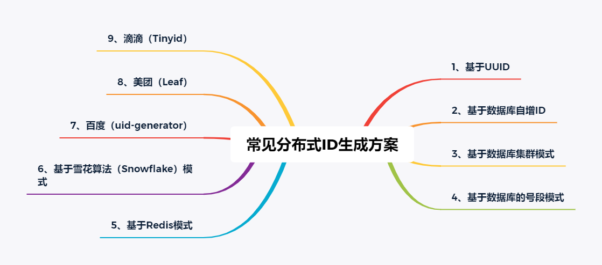

# 一、数据库自增ID

## 1.1 数据库自增ID原理
以MySQL举例，利用给字段设置auto_increment_increment和auto_increment_offset来保证ID自增，每次业务使用下列SQL读写MySQL得到ID号。
```mysql
CREATE DATABASE `SEQ_ID`;
CREATE TABLE SEQID.SEQUENCE_ID (
    id bigint(20) unsigned NOT NULL auto_increment, 
    value char(10) NOT NULL default '',
    PRIMARY KEY (id),
);

insert into SEQUENCE_ID(value)  VALUES ('values');

```

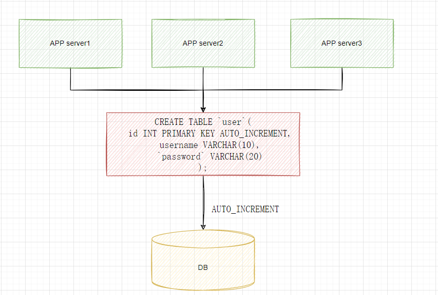

数据库自增ID的优点：
1. 非常简单，利用现有数据库系统的功能实现，成本小，有DBA专业维护。
2. ID号单调自增，可以实现一些对ID有特殊要求的业务。

数据库自增ID的缺点：
1. 强依赖DB，当DB异常时整个系统不可用，属于致命问题。配置主从复制可以尽可能的增加可用性，但是数据一致性在特殊情况下难以保证。主从切换时的不一致可能会导致重复发号。
2. ID发号性能瓶颈限制在单台MySQL的读写性能。

# 二、数据库自增ID的优化方案

## 2.1 数据库自增ID的优化方案原理
对于MySQL性能问题，可用如下方案解决：
在分布式系统中我们可以多部署几台机器，每台机器设置不同的初始值，且步长和机器数相等。
比如有两台机器。设置步长step为2，TicketServer1的初始值为1（1，3，5，7，9，11…）、
TicketServer2的初始值为2（2，4，6，8，10…）。这是Flickr团队在2010年撰文介绍的一种主键生成策略。
如下所示，为了实现上述方案分别设置两台机器对应的参数，TicketServer1从1开始发号，TicketServer2从2开始发号，两台机器每次发号之后都递增2。
```mysql
# TicketServer1:
set @@auto_increment_offset = 1;     -- 起始值
set @@auto_increment_increment = 2;  -- 步长

 
# TicketServer2:
set @@auto_increment_offset = 2;     -- 起始值
set @@auto_increment_increment = 2;  -- 步长

```

假设我们要部署N台机器，步长需设置为N，每台的初始值依次为0,1,2…N-1那么整个架构就变成了如下图所示：

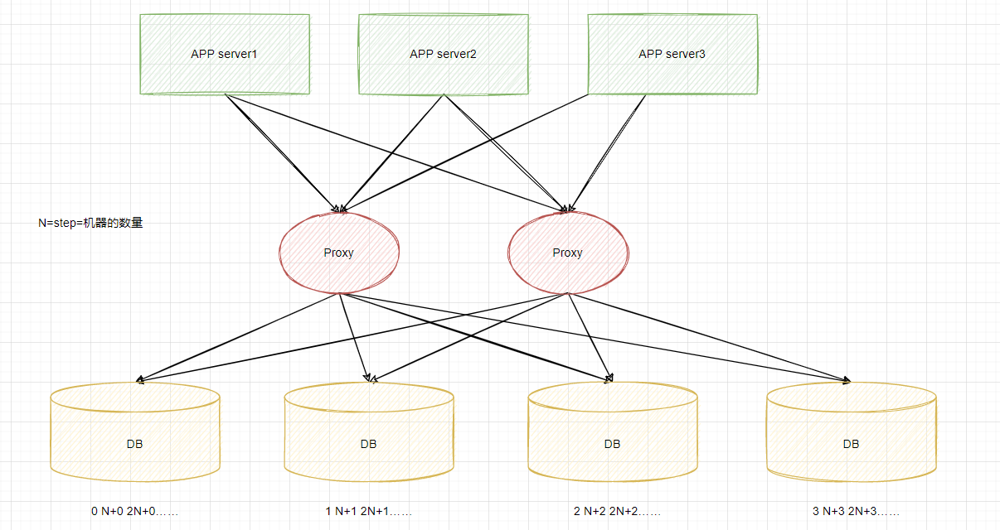

## 2.2 数据库优化方案的缺点：
1. 系统水平扩展比较困难，比如定义好了步长和机器台数之后，如果要添加机器该怎么做？假设现在只有一台机器发号是1,2,3,4,5（步长是1），这个时候需要扩容机器一台。可以这样做：把第二台机器的初始值设置得比第一台超过很多，比如14（假设在扩容时间之内第一台不可能发到14），同时设置步长为2，那么这台机器下发的号码都是14以后的偶数。然后摘掉第一台，把ID值保留为奇数，比如7，然后修改第一台的步长为2。让它符合我们定义的号段标准，对于这个例子来说就是让第一台以后只能产生奇数。扩容方案看起来复杂吗？貌似还好，现在想象一下如果我们线上有100台机器，这个时候要扩容该怎么做？简直是噩梦。所以系统水平扩展方案复杂难以实现。
2. ID没有了单调递增的特性，只能趋势递增，这个缺点对于一般业务需求不是很重要，可以容忍。
3. 数据库压力还是很大，每次获取ID都得读写一次数据库，只能靠堆机器来提高性能。

# 三、UUID算法生成ID

## 3.1 UUID算法的原理
UUID算法的定义：标准型式包含32个16进制数字，以连字号分为五段，形式为8-4-4-4-12的36个字符，示例：550e8400-e29b-41d4-a716-446655440000，
通常使用UUID的方式是使用：时间戳（当前日期+时间)+时钟序列+机器识别号(MAC、其它)。到目前为止业界一共有5种方式生成UUID：
1. 基于时间的UUID - 版本1：这个一般是通过当前时间，随机数，和本地Mac地址来计算出来，可以通过 org.apache.logging.log4j.core.util包中的 UuidUtil.getTimeBasedUuid()来使用或者其他包中工具。由于使用了MAC地址，因此能够确保唯一性，但是同时也暴露了MAC地址，私密性不够好。
2. DCE安全的UUID - 版本2：DCE（Distributed Computing Environment）安全的UUID和基于时间的UUID算法相同，但会把时间戳的前4位置换为POSIX的UID或GID。这个版本的UUID在实际中较少用到。
3. 基于名字的UUID（MD5）- 版本3：基于名字的UUID通过计算名字和名字空间的MD5散列值得到。这个版本的UUID保证了：相同名字空间中不同名字生成的UUID的唯一性；不同名字空间中的UUID的唯一性；相同名字空间中相同名字的UUID重复生成是相同的。
4. 随机UUID - 版本4：根据随机数，或者伪随机数生成UUID。这种UUID产生重复的概率是可以计算出来的，但是重复的可能性可以忽略不计，因此该版本也是被经常使用的版本。JDK中使用的就是这个版本。
5. 基于名字的UUID（SHA1） - 版本5：和基于名字的UUID算法类似，只是散列值计算使用SHA1（Secure Hash Algorithm 1）算法。

UUID算法优点:
1. 性能非常高：本地生成，没有网络消耗。

UUID算法缺点：
1. 不易于存储：UUID太长，16字节128位，通常以36长度的字符串表示，很多场景不适用。
2. 信息不安全：基于MAC地址生成UUID的算法可能会造成MAC地址泄露，这个漏洞曾被用于寻找梅丽莎病毒的制作者位置。
3. ID作为主键时在特定的环境会存在一些问题，比如做DB主键的场景下，UUID就非常不适用：MySQL官方有明确的建议主键要尽量越短越好，36个字符长度的UUID不符合要求。对MySQL索引不利：如果作为数据库主键，在InnoDB引擎下，UUID的无序性可能会引起数据位置频繁变动，严重影响性能。

## 3.2 UUID算法的实现

> src code: https://gitee.com/xjl2462612540/SeniorArchitect/tree/master/SenoirArchitect_Project/distributedid


# 四、Snowflake雪花算法

## 4.1 Snowflake雪花算法原理
这种方案大致来说是一种以划分命名空间（UUID也算，由于比较常见，所以单独分析）来生成ID的一种算法，这种方案把64-bit分别划分成多段，分开来标示机器、时间等，
比如在snowflake中的64-bit分别表示如下图（图片来自网络）所示：

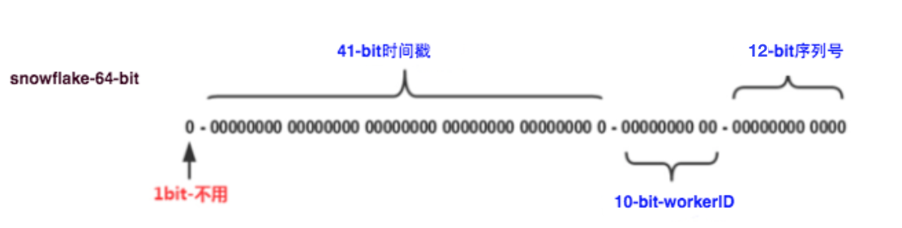
1. 41-bit的时间可以表示（1L<<41）/(1000L*3600*24*365)=69年的时间，
2. 10-bit机器可以分别表示1024台机器。如果我们对IDC划分有需求，还可以将10-bit分5-bit给IDC，分5-bit给工作机器。这样就可以表示32个IDC，每个IDC下可以有32台机器，可以根据自身需求定义。
3. 12个自增序列号可以表示2^12个ID，理论上snowflake方案的QPS约为409.6w/s，这种分配方式可以保证在任何一个IDC的任何一台机器在任意毫秒内生成的ID都是不同的

Snowflake优点：
1. 毫秒数在高位，自增序列在低位，整个ID都是趋势递增的。
2. 不依赖数据库等第三方系统，以服务的方式部署，稳定性更高，生成ID的性能也是非常高的。
3. 可以根据自身业务特性分配bit位，非常灵活。

Snowflake缺点：
1. 强依赖机器时钟，如果机器上时钟回拨，会导致发号重复或者服务会处于不可用状态。

## 4.2 Snowflake雪花算法实现

> src code: https://gitee.com/xjl2462612540/SeniorArchitect/tree/master/SenoirArchitect_Project/distributedid

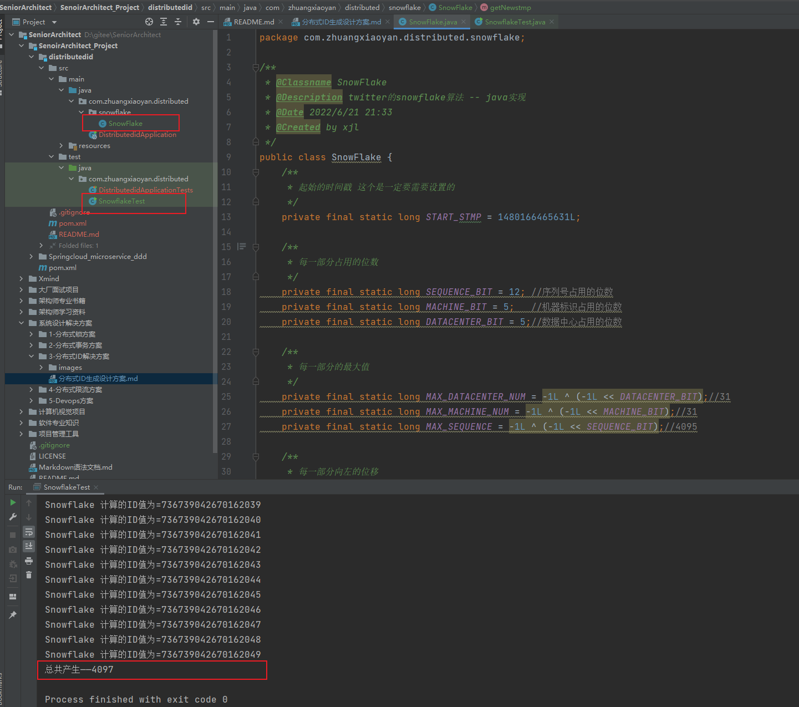

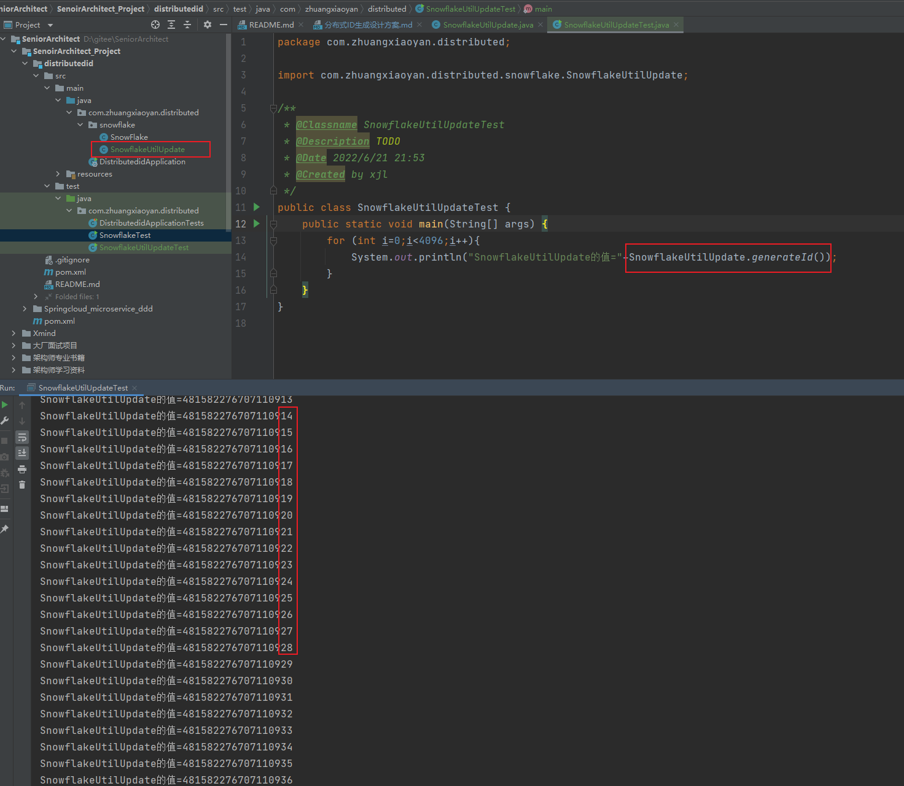

## 4.3 Snowflake雪花算法问题

Snowflake一毫秒的能够产生的最大的个数是4096个。如果是的超过的4096那就等到下一秒的来生成的。Snowflake算法1s生成的ID是300W+的ID。

### 4.3.1 时钟回拨问题的解决方案
因为机器的原因会发生时间回拨，我们的雪花算法是强依赖我们的时间的，如果时间发生回拨，有可能会生成重复的ID，在我们上面的nextId中我们用当前时间和上一次的时间进行判断，
如果当前时间小于上一次的时间那么肯定是发生了回拨，普通的算法会直接抛出异常,这里我们可以对其进行优化,一般分为两个情况:
1. 如果时间回拨时间较短，比如配置5ms以内，那么可以直接等待一定的时间，让机器的时间追上来。
2. 如果时间的回拨时间较长，我们不能接受这么长的阻塞等待，那么又有两个策略:
   1. 直接拒绝，抛出异常，打日志，通知RD时钟回滚。
   2. 利用扩展位，上面我们讨论过不同业务场景位数可能用不到那么多，那么我们可以把扩展位数利用起来了，
比如当这个时间回拨比较长的时候，我们可以不需要等待，直接在扩展位加1。2位的扩展位允许我们有3次大的时钟回拨，一般来说就够了，
如果其超过三次我们还是选择抛出异常，打日志。通过上面的几种策略可以比较的防护我们的时钟回拨，防止出现回拨之后大量的异常出现。

# 五、Redis生产策略ID

## 5.1 Redis构建全局唯一ID原理
1. 利用Redis的单线程执行的原理，使用的原子类保证了全局唯一的递增变量。
2. 利用了redis的高并发性能的原理来实现的

Redis生产策略ID优点:
1. 不依赖于数据库，灵活方便，且性能优于数据库。
2. 数字ID天然排序，对分页或者需要排序的结果很有帮助。

Redis生产策略ID缺点:
1. 如果系统中没有Redis，还需要引入新的组件，增加系统复杂度。
2. 需要编码和配置的工作量比较大。

# 六、Leaf-segment算法

## 6.1 Leaf-segment算法原理
第一种Leaf-segment方案，在使用数据库的方案上，做了如下改变：
1. 原方案每次获取ID都得读写一次数据库，造成数据库压力大。改为利用proxy server批量获取，每次获取一个segment(step决定大小)号段的值。用完之后再去数据库获取新的号段，可以大大的减轻数据库的压力。
2. 各个业务不同的发号需求用biz_tag字段来区分，每个biz-tag的ID获取相互隔离，互不影响。如果以后有性能需求需要对数据库扩容，不需要上述描述的复杂的扩容操作，只需要对biz_tag分库分表就行。

```mysql
+-------------+--------------+------+-----+-------------------+-----------------------------+
| Field       | Type         | Null | Key | Default           | Extra                       |
+-------------+--------------+------+-----+-------------------+-----------------------------+
| biz_tag     | varchar(128) | NO   | PRI |                   |                             |
| max_id      | bigint(20)   | NO   |     | 1                 |                             |
| step        | int(11)      | NO   |     | NULL              |                             |
| desc        | varchar(256) | YES  |     | NULL              |                             |
| update_time | timestamp    | NO   |     | CURRENT_TIMESTAMP | on update CURRENT_TIMESTAMP |
+-------------+--------------+------+-----+-------------------+-----------------------------+
```
重要字段说明：
1. biz_tag用来区分业务，
2. max_id表示该biz_tag目前所被分配的ID号段的最大值，
3. step表示每次分配的号段长度。原来获取ID每次都需要写数据库，现在只需要把step设置得足够大，比如1000。那么只有当1000个号被消耗完了之后才会去重新读写一次数据库。读写数据库的频率从1减小到了1/step，

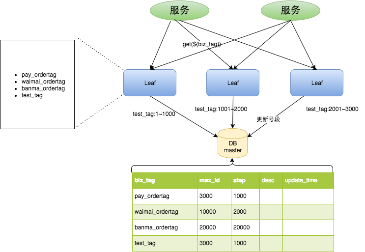

test_tag在第一台Leaf机器上是1~1000的号段，当这个号段用完时，会去加载另一个长度为step=1000的号段，假设另外两台号段都没有更新，
这个时候第一台机器新加载的号段就应该是3001~4000。同时数据库对应的biz_tag这条数据的max_id会从3000被更新成4000，更新号段的SQL语句如下：
```mysql
Begin
UPDATE table SET max_id=max_id+step WHERE biz_tag=xxx
SELECT tag, max_id, step FROM table WHERE biz_tag=xxx
Commit
```
Leaf-segment算法优点：
1. Leaf服务可以很方便的线性扩展，性能完全能够支撑大多数业务场景。
2. ID号码是趋势递增的8byte的64位数字，满足上述数据库存储的主键要求。
3. 容灾性高：Leaf服务内部有号段缓存，即使DB宕机，短时间内Leaf仍能正常对外提供服务。
4. 可以自定义max_id的大小，非常方便业务从原有的ID方式上迁移过来。

Leaf-segment算法缺点：
1. ID号码不够随机，能够泄露发号数量的信息，不太安全。
2. TP999数据波动大，当号段使用完之后还是会hang在更新数据库的I/O上，tg999数据会出现偶尔的尖刺。
3. DB宕机会造成整个系统不可用。

## 6.2 Leaf-segment优化方案
对于第二个缺点，Leaf-segment做了一些优化，简单的说就是：

1. Leaf取号段的时机是在号段消耗完的时候进行的，也就意味着号段临界点的ID下发时间取决于下一次从DB取回号段的时间，并且在这期间进来的请求也会因为DB号段没有取回来，导致线程阻塞。如果请求DB的网络和DB的性能稳定，这种情况对系统的影响是不大的，但是假如取DB的时候网络发生抖动，或者DB发生慢查询就会导致整个系统的响应时间变慢。

为此，我们希望DB取号段的过程能够做到无阻塞，不需要在DB取号段的时候阻塞请求线程，即当号段消费到某个点时就异步的把下一个号段加载到内存中。而不需要等到号段用尽的时候才去更新号段。这样做就可以很大程度上的降低系统的TP999指标。详细实现如下图所示：

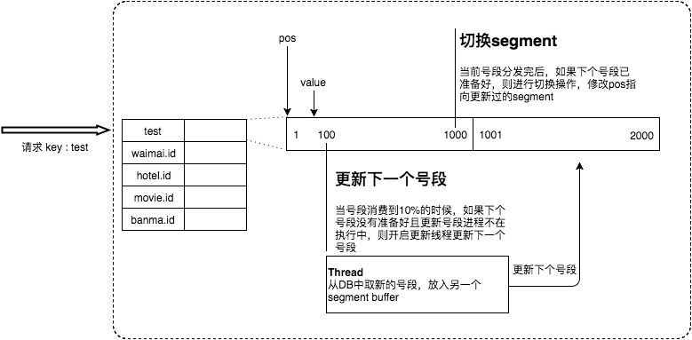

采用双buffer的方式，Leaf服务内部有两个号段缓存区segment。当前号段已下发10%时，如果下一个号段未更新，则另启一个更新线程去更新下一个号段。
当前号段全部下发完后，如果下个号段准备好了则切换到下个号段为当前segment接着下发，循环往复。
1. 每个biz-tag都有消费速度监控，通常推荐segment长度设置为服务高峰期发号QPS的600倍（10分钟），这样即使DB宕机，Leaf仍能持续发号10-20分钟不受影响。
2. 每次请求来临时都会判断下个号段的状态，从而更新此号段，所以偶尔的网络抖动不会影响下个号段的更新。

## 6.3 Leaf高可用容灾方案
对于第三点“DB可用性”问题，我们目前采用一主两从的方式，同时分机房部署，Master和Slave之间采用半同步方式同步数据。
同时使用公司Atlas数据库中间件(已开源，改名为DBProxy)做主从切换。当然这种方案在一些情况会退化成异步模式，
甚至在非常极端情况下仍然会造成数据不一致的情况，但是出现的概率非常小。如果你的系统要保证100%的数据强一致，
可以选择使用“类Paxos算法”实现的强一致MySQL方案。

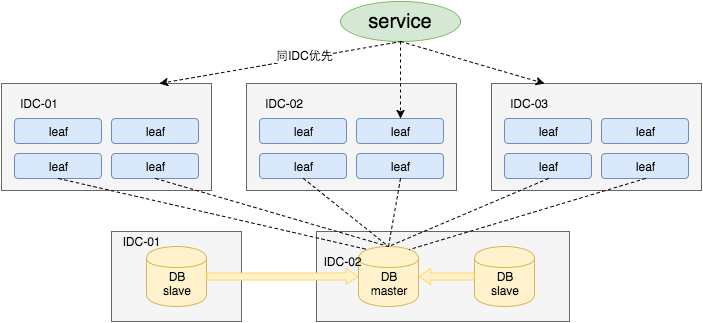

同时Leaf服务分IDC部署，内部的服务化框架是“MTthrift RPC”。服务调用的时候，根据负载均衡算法会优先调用同机房的Leaf服务。
在该IDC内Leaf服务不可用的时候才会选择其他机房的Leaf服务。同时服务治理平台OCTO还提供了针对服务的过载保护、一键截流、动态流量分配等对服务的保护措施。

# 七、Leaf-snowflake算法
Leaf-segment方案可以生成趋势递增的ID，同时ID号是可计算的，不适用于订单ID生成场景，比如竞对在两天中午12点分别下单，通过订单id号相减就能大致计算出公司一天的订单量，这个是不能忍受的。面对这一问题，我们可以采用Leaf-snowflake方案。

## 7.1 Leaf-snowflake算法原理
Leaf-snowflake方案完全沿用snowflake方案的bit位设计，即是“1+41+10+12”的方式组装ID号。对于workerID的分配，
当服务集群数量较小的情况下，完全可以手动配置。Leaf服务规模较大，动手配置成本太高。
所以使用Zookeeper持久顺序节点的特性自动对snowflake节点配置wokerID。Leaf-snowflake是按照下面几个步骤启动的：

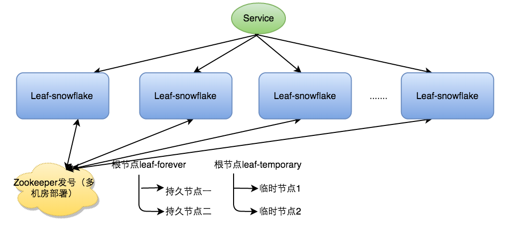

弱依赖ZooKeeper

- 除了每次会去ZK拿数据以外，也会在本机文件系统上缓存一个workerID文件。当ZooKeeper出现问题，恰好机器出现问题需要重启时，
能保证服务能够正常启动。这样做到了对三方组件的弱依赖。一定程度上提高了SLA。

解决时钟问题
- 因为这种方案依赖时间，如果机器的时钟发生了回拨，那么就会有可能生成重复的ID号，需要解决时钟回退的问题。
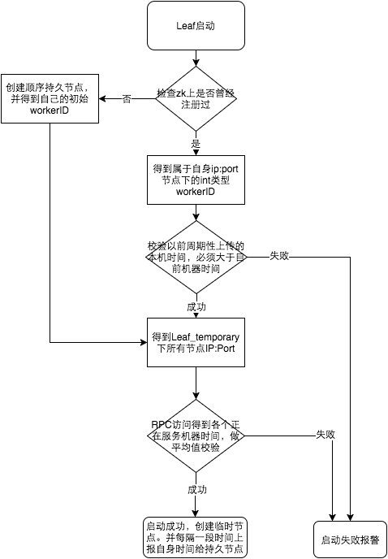

参见上图整个启动流程图，服务启动时首先检查自己是否写过ZooKeeper leaf_forever节点：

1. 若写过，则用自身系统时间与leaf_forever/${self}节点记录时间做比较，若小于leaf_forever/${self}时间则认为机器时间发生了大步长回拨，服务启动失败并报警。
2. 若未写过，证明是新服务节点，直接创建持久节点leaf_forever/${self}并写入自身系统时间，接下来综合对比其余Leaf节点的系统时间来判断自身系统时间是否准确，具体做法是取leaf_temporary下的所有临时节点(所有运行中的Leaf-snowflake节点)的服务IP：Port，然后通过RPC请求得到所有节点的系统时间，计算sum(time)/nodeSize。
3. 若abs( 系统时间-sum(time)/nodeSize ) < 阈值，认为当前系统时间准确，正常启动服务，同时写临时节点leaf_temporary/${self} 维持租约。
4. 否则认为本机系统时间发生大步长偏移，启动失败并报警。
5. 每隔一段时间(3s)上报自身系统时间写入leaf_forever/${self}。

由于强依赖时钟，对时间的要求比较敏感，在机器工作时NTP同步也会造成秒级别的回退，建议可以直接关闭NTP同步。
要么在时钟回拨的时候直接不提供服务直接返回ERROR_CODE，等时钟追上即可。或者做一层重试，然后上报报警系统，
更或者是发现有时钟回拨之后自动摘除本身节点并报警，在美团在2017年闰秒出现那一次出现过部分机器回拨，
由于Leaf-snowflake的策略保证，成功避免了对业务造成的影响。

```java
//发生了回拨，此刻时间小于上次发号时间
 if (timestamp < lastTimestamp) {
     long offset = lastTimestamp - timestamp;
     if (offset <= 5) {
     try {
     //时间偏差大小小于5ms，则等待两倍时间
     wait(offset << 1);//wait
     timestamp = timeGen();
     if (timestamp < lastTimestamp) {
        //还是小于，抛异常并上报
        throwClockBackwardsEx(timestamp);
        }
     } catch (InterruptedException e) {
        throw  e;
        }
     } else {
        //throw
        throwClockBackwardsEx(timestamp);
     }
}  
```

Leaf-snowflake方案优点：
1. Leaf在美团点评公司内部服务包含金融、支付交易、餐饮、外卖、酒店旅游、猫眼电影等众多业务线。
2. 目前Leaf的性能在4C8G的机器上QPS能压测到近5w/s，TP999 1ms，已经能够满足大部分的业务的需求。
3. 每天提供亿数量级的调用量，作为公司内部公共的基础技术设施，必须保证高SLA和高性能的服务，当然项目开发中还有很多提高的空间。

# 八、uid-generator算法
UidGenerator是Java实现的, 基于Snowflake算法的唯一ID生成器。UidGenerator以组件形式工作在应用项目中, 支持自定义workerId位数和初始化策略,
从而适用于docker等虚拟化环境下实例自动重启、漂移等场景。 在实现上, UidGenerator通过借用未来时间来解决sequence天然存在的并发限制; 
采用RingBuffer来缓存已生成的UID, 并行化UID的生产和消费, 同时对CacheLine补齐，避免了由RingBuffer带来的硬件级「伪共享」问题. 最终单机QPS可达600万。
- 依赖版本：Java8及以上版本, MySQL(内置WorkerID分配器, 启动阶段通过DB进行分配; 如自定义实现, 则DB非必选依赖）

## 8.1 CachedUidGenerator

RingBuffer环形数组，数组每个元素成为一个slot。RingBuffer容量，默认为Snowflake算法中sequence最大值，且为2^N。
可通过boostPower配置进行扩容，以提高RingBuffer 读写吞吐量。Tail指针、Cursor指针用于环形数组上读写slot：

1. Tail指针：表示Producer生产的最大序号(此序号从0开始，持续递增)。Tail不能超过Cursor，即生产者不能覆盖未消费的slot。当Tail已赶上curosr，此时可通过rejectedPutBufferHandler指定PutRejectPolicy

2. Cursor指针：表示Consumer消费到的最小序号(序号序列与Producer序列相同)。Cursor不能超过Tail，即不能消费未生产的slot。当Cursor已赶上tail，此时可通过rejectedTakeBufferHandler指定TakeRejectPolicy

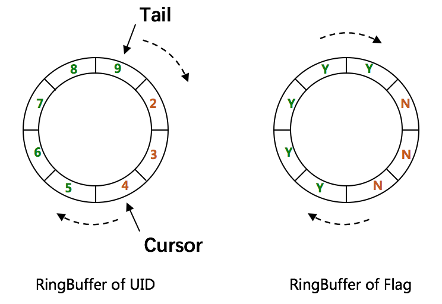

CachedUidGenerator采用了双RingBuffer，Uid-RingBuffer用于存储Uid、Flag-RingBuffer用于存储Uid状态(是否可填充、是否可消费)

由于数组元素在内存中是连续分配的，可最大程度利用CPU cache以提升性能。但同时会带来「伪共享」FalseSharing问题，为此在Tail、Cursor指针、Flag-RingBuffer中采用了CacheLine 补齐方式。

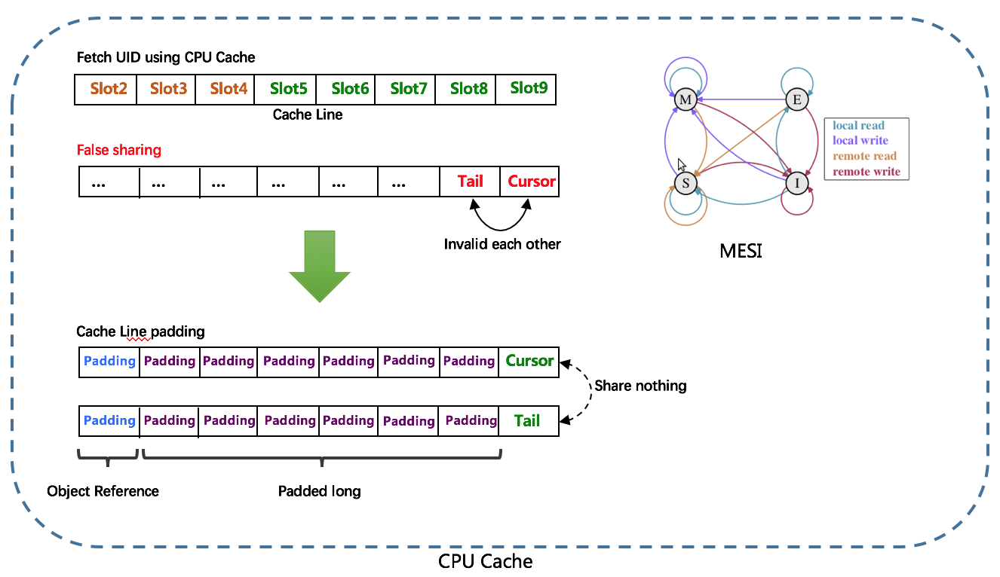

RingBuffer填充时机

1. 初始化预填充：RingBuffer初始化时，预先填充满整个RingBuffer.

2. 即时填充：Take消费时，即时检查剩余可用slot量(tail - cursor)，如小于设定阈值，则补全空闲slots。阈值可通过paddingFactor来进行配置，请参考Quick Start中CachedUidGenerator配置

3. 周期填充：通过Schedule线程，定时补全空闲slots。可通过scheduleInterval配置，以应用定时填充功能，并指定Schedule时间间隔

## 8.2 CachedUidGenerator实现
1. 步骤1: 安装依赖：先下载Java8, MySQL和Maven
```shell
# 设置环境变量
export MAVEN_HOME=/xxx/xxx/software/maven/apache-maven-3.3.9
export PATH=$MAVEN_HOME/bin:$PATH
JAVA_HOME="/Library/Java/JavaVirtualMachines/jdk1.8.0_91.jdk/Contents/Home";
export JAVA_HOME;
```
2. 创建表WORKER_NODE
```mysql
DROP DATABASE IF EXISTS `xxxx`;
CREATE DATABASE `xxxx` ;
use `xxxx`;
DROP TABLE IF EXISTS WORKER_NODE;
CREATE TABLE WORKER_NODE
(
ID BIGINT NOT NULL AUTO_INCREMENT COMMENT 'auto increment id',
HOST_NAME VARCHAR(64) NOT NULL COMMENT 'host name',
PORT VARCHAR(64) NOT NULL COMMENT 'port',
TYPE INT NOT NULL COMMENT 'node type: ACTUAL or CONTAINER',
LAUNCH_DATE DATE NOT NULL COMMENT 'launch date',
MODIFIED TIMESTAMP NOT NULL COMMENT 'modified time',
CREATED TIMESTAMP NOT NULL COMMENT 'created time',
PRIMARY KEY(ID)
)
 COMMENT='DB WorkerID Assigner for UID Generator',ENGINE = INNODB;
```
修改mysql.properties配置中, jdbc.url, jdbc.username和jdbc.password, 确保库地址, 名称, 端口号, 用户名和密码正确.
3. 修改Spring配置

提供了两种生成器: DefaultUidGenerator、CachedUidGenerator。如对UID生成性能有要求, 请使用CachedUidGenerator
对应Spring配置分别为: default-uid-spring.xml、cached-uid-spring.xml

- DefaultUidGenerator配置
```xml
   <!-- DefaultUidGenerator -->
<bean id="defaultUidGenerator" class="com.baidu.fsg.uid.impl.DefaultUidGenerator" lazy-init="false">
    <property name="workerIdAssigner" ref="disposableWorkerIdAssigner"/>

    <!-- Specified bits & epoch as your demand. No specified the default value will be used -->
    <property name="timeBits" value="29"/>
    <property name="workerBits" value="21"/>
    <property name="seqBits" value="13"/>
    <property name="epochStr" value="2016-09-20"/>
</bean>
 
<!-- 用完即弃的WorkerIdAssigner，依赖DB操作 -->
<bean id="disposableWorkerIdAssigner" class="com.baidu.fsg.uid.worker.DisposableWorkerIdAssigner" />
```
- CachedUidGenerator配置
```xml
<!-- CachedUidGenerator -->
<bean id="cachedUidGenerator" class="com.baidu.fsg.uid.impl.CachedUidGenerator">
    <property name="workerIdAssigner" ref="disposableWorkerIdAssigner" />
    <!-- 以下为可选配置, 如未指定将采用默认值 -->
    <!-- Specified bits & epoch as your demand. No specified the default value will be used -->
    <property name="timeBits" value="29"/>
    <property name="workerBits" value="21"/>
    <property name="seqBits" value="13"/>
    <property name="epochStr" value="2016-09-20"/>
    <!-- RingBuffer size扩容参数, 可提高UID生成的吞吐量. -->
    <!-- 默认:3， 原bufferSize=8192, 扩容后bufferSize= 8192 << 3 = 65536 -->
    <property name="boostPower" value="3"></property>
    <!-- 指定何时向RingBuffer中填充UID, 取值为百分比(0, 100), 默认为50 -->
    <!-- 举例: bufferSize=1024, paddingFactor=50 -> threshold=1024 * 50 / 100 = 512. -->
    <!-- 当环上可用UID数量 < 512时, 将自动对RingBuffer进行填充补全 -->
    <property name="paddingFactor" value="50"></property>
    <!-- 另外一种RingBuffer填充时机, 在Schedule线程中, 周期性检查填充 -->
    <!-- 默认:不配置此项, 即不实用Schedule线程. 如需使用, 请指定Schedule线程时间间隔, 单位:秒 -->
    <property name="scheduleInterval" value="60"></property>
    <!-- 拒绝策略: 当环已满, 无法继续填充时 -->
    <!-- 默认无需指定, 将丢弃Put操作, 仅日志记录. 如有特殊需求, 请实现RejectedPutBufferHandler接口(支持Lambda表达式) -->
    <property name="rejectedPutBufferHandler" ref="XxxxYourPutRejectPolicy"></property>
    <!-- 拒绝策略: 当环已空, 无法继续获取时 -->
    <!-- 默认无需指定, 将记录日志, 并抛出UidGenerateException异常. 如有特殊需求, 请实现RejectedTakeBufferHandler接口(支持Lambda表达式) -->
    <property name="rejectedTakeBufferHandler" ref="XxxxYourTakeRejectPolicy"></property>
</bean>
<!-- 用完即弃的WorkerIdAssigner, 依赖DB操作 -->
<bean id="disposableWorkerIdAssigner" class="com.baidu.fsg.uid.worker.DisposableWorkerIdAssigner" />
```

4. Mybatis配置

mybatis-spring.xml配置说明如下:
```xml
<!-- Spring annotation扫描 -->
<context:component-scan base-package="com.baidu.fsg.uid" />

<bean id="sqlSessionFactory" class="org.mybatis.spring.SqlSessionFactoryBean">
    <property name="dataSource" ref="dataSource" />
    <property name="mapperLocations" value="classpath:/META-INF/mybatis/mapper/M_WORKER*.xml" />
</bean>

<!-- 事务相关配置 -->
<tx:annotation-driven transaction-manager="transactionManager" order="1" />

<bean id="transactionManager" class="org.springframework.jdbc.datasource.DataSourceTransactionManager">
	<property name="dataSource" ref="dataSource" />
</bean>

<!-- Mybatis Mapper扫描 -->
<bean class="org.mybatis.spring.mapper.MapperScannerConfigurer">
	<property name="annotationClass" value="org.springframework.stereotype.Repository" />
	<property name="basePackage" value="com.baidu.fsg.uid.worker.dao" />
	<property name="sqlSessionFactoryBeanName" value="sqlSessionFactory" />
</bean>

<!-- 数据源配置 -->
<bean id="dataSource" parent="abstractDataSource">
	<property name="driverClassName" value="${mysql.driver}" />
	<property name="maxActive" value="${jdbc.maxActive}" />
	<property name="url" value="${jdbc.url}" />
	<property name="username" value="${jdbc.username}" />
	<property name="password" value="${jdbc.password}" />
</bean>

<bean id="abstractDataSource" class="com.alibaba.druid.pool.DruidDataSource" destroy-method="close">
	<property name="filters" value="${datasource.filters}" />
	<property name="defaultAutoCommit" value="${datasource.defaultAutoCommit}" />
	<property name="initialSize" value="${datasource.initialSize}" />
	<property name="minIdle" value="${datasource.minIdle}" />
	<property name="maxWait" value="${datasource.maxWait}" />
	<property name="testWhileIdle" value="${datasource.testWhileIdle}" />
	<property name="testOnBorrow" value="${datasource.testOnBorrow}" />
	<property name="testOnReturn" value="${datasource.testOnReturn}" />
	<property name="validationQuery" value="${datasource.validationQuery}" />
	<property name="timeBetweenEvictionRunsMillis" value="${datasource.timeBetweenEvictionRunsMillis}" />
	<property name="minEvictableIdleTimeMillis" value="${datasource.minEvictableIdleTimeMillis}" />
	<property name="logAbandoned" value="${datasource.logAbandoned}" />
	<property name="removeAbandoned" value="${datasource.removeAbandoned}" />
	<property name="removeAbandonedTimeout" value="${datasource.removeAbandonedTimeout}" />
</bean>

<bean id="batchSqlSession" class="org.mybatis.spring.SqlSessionTemplate">
	<constructor-arg index="0" ref="sqlSessionFactory" />
	<constructor-arg index="1" value="BATCH" />
</bean>
```
5. 运行示例单测

运行单测CachedUidGeneratorTest, 展示UID生成、解析等功能

```java
@Resource
private UidGenerator uidGenerator;
@Test
public void testSerialGenerate() {
    // Generate UID
    long uid = uidGenerator.getUID();

    // Parse UID into [Timestamp, WorkerId, Sequence]
    // {"UID":"180363646902239241","parsed":{    "timestamp":"2017-01-19 12:15:46",    "workerId":"4",    "sequence":"9"        }}
    System.out.println(uidGenerator.parseUID(uid));
}
```

关于UID比特分配的建议：

1. 对于并发数要求不高、期望长期使用的应用, 可增加timeBits位数, 减少seqBits位数. 例如节点采取用完即弃的WorkerIdAssigner策略, 重启频率为12次/天, 那么配置成{"workerBits":23,"timeBits":31,"seqBits":9}时, 可支持28个节点以整体并发量14400 UID/s的速度持续运行68年.
2. 对于节点重启频率频繁、期望长期使用的应用, 可增加workerBits和timeBits位数, 减少seqBits位数. 例如节点采取用完即弃的WorkerIdAssigner策略, 重启频率为24*12次/天, 那么配置成{"workerBits":27,"timeBits":30,"seqBits":6}时, 可支持37个节点以整体并发量2400 UID/s的速度持续运行34年.

# 九、Tinyid算法
Tinyid是基于号段模式原理实现的与Leaf如出一辙，每个服务获取一个号段（1000,2000]、（2000,3000]、（3000,4000]

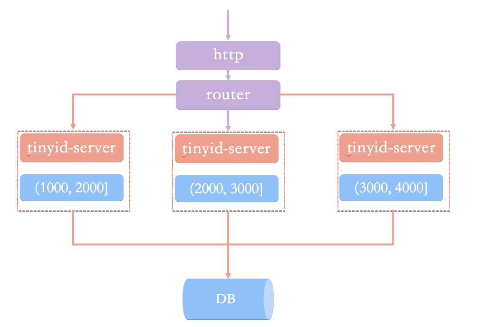

## 9.1 Tinyid实现
1. 导入Tinyid源码： git clone https://github.com/didi/tinyid.git
2. 创建数据表：
```mysql
CREATE TABLE `tiny_id_info` (
  `id` bigint(20) unsigned NOT NULL AUTO_INCREMENT COMMENT '自增主键',
  `biz_type` varchar(63) NOT NULL DEFAULT '' COMMENT '业务类型，唯一',
  `begin_id` bigint(20) NOT NULL DEFAULT '0' COMMENT '开始id，仅记录初始值，无其他含义。初始化时begin_id和max_id应相同',
  `max_id` bigint(20) NOT NULL DEFAULT '0' COMMENT '当前最大id',
  `step` int(11) DEFAULT '0' COMMENT '步长',
  `delta` int(11) NOT NULL DEFAULT '1' COMMENT '每次id增量',
  `remainder` int(11) NOT NULL DEFAULT '0' COMMENT '余数',
  `create_time` timestamp NOT NULL DEFAULT '2010-01-01 00:00:00' COMMENT '创建时间',
  `update_time` timestamp NOT NULL DEFAULT '2010-01-01 00:00:00' COMMENT '更新时间',
  `version` bigint(20) NOT NULL DEFAULT '0' COMMENT '版本号',
  PRIMARY KEY (`id`),
  UNIQUE KEY `uniq_biz_type` (`biz_type`)
) ENGINE=InnoDB AUTO_INCREMENT=1 DEFAULT CHARSET=utf8 COMMENT 'id信息表';

CREATE TABLE `tiny_id_token` (
  `id` int(11) unsigned NOT NULL AUTO_INCREMENT COMMENT '自增id',
  `token` varchar(255) NOT NULL DEFAULT '' COMMENT 'token',
  `biz_type` varchar(63) NOT NULL DEFAULT '' COMMENT '此token可访问的业务类型标识',
  `remark` varchar(255) NOT NULL DEFAULT '' COMMENT '备注',
  `create_time` timestamp NOT NULL DEFAULT '2010-01-01 00:00:00' COMMENT '创建时间',
  `update_time` timestamp NOT NULL DEFAULT '2010-01-01 00:00:00' COMMENT '更新时间',
  PRIMARY KEY (`id`)
) ENGINE=InnoDB AUTO_INCREMENT=1 DEFAULT CHARSET=utf8 COMMENT 'token信息表';

INSERT INTO `tiny_id_info` (`id`, `biz_type`, `begin_id`, `max_id`, `step`, `delta`, `remainder`, `create_time`, `update_time`, `version`)
VALUES
    (1, 'test', 1, 1, 100000, 1, 0, '2018-07-21 23:52:58', '2018-07-22 23:19:27', 1);

INSERT INTO `tiny_id_info` (`id`, `biz_type`, `begin_id`, `max_id`, `step`, `delta`, `remainder`, `create_time`, `update_time`, `version`)
VALUES
    (2, 'test_odd', 1, 1, 100000, 2, 1, '2018-07-21 23:52:58', '2018-07-23 00:39:24', 3);


INSERT INTO `tiny_id_token` (`id`, `token`, `biz_type`, `remark`, `create_time`, `update_time`)
VALUES
    (1, '0f673adf80504e2eaa552f5d791b644c', 'test', '1', '2017-12-14 16:36:46', '2017-12-14 16:36:48');

INSERT INTO `tiny_id_token` (`id`, `token`, `biz_type`, `remark`, `create_time`, `update_time`)
VALUES
    (2, '0f673adf80504e2eaa552f5d791b644c', 'test_odd', '1', '2017-12-14 16:36:46', '2017-12-14 16:36:48');
```

3. 配置数据库：
```shell
datasource.tinyid.names=primary
datasource.tinyid.primary.driver-class-name=com.mysql.jdbc.Driver
datasource.tinyid.primary.url=jdbc:mysql://192.168.25.136:3306/tinyidtest?autoReconnect=true&useUnicode=true&characterEncoding=UTF-8
datasource.tinyid.primary.username=root
datasource.tinyid.primary.password=root
```
4. 启动tinyid-server后测试
```shell
获取分布式自增ID: http://localhost:9999/tinyid/id/nextIdSimple?bizType=test&token=0f673adf80504e2eaa552f5d791b644c'
返回结果: 3

批量获取分布式自增ID: http://localhost:9999/tinyid/id/nextIdSimple?bizType=test&token=0f673adf80504e2eaa552f5d791b644c&batchSize=10'
返回结果:  4,5,6,7,8,9,10,11,12,13
```
5. Java客户端方式接入
```shell
<dependency>
    <groupId>com.xiaoju.uemc.tinyid</groupId>
    <artifactId>tinyid-client</artifactId>
    <version>${tinyid.version}</version>
</dependency>
```
```shell
# 配置文件
tinyid.server =localhost:9999
tinyid.token =0f673adf80504e2eaa552f5d791b644c
```
test 、tinyid.token是在数据库表中预先插入的数据，test 是具体业务类型，tinyid.token表示可访问的业务类型
```java
// 获取单个分布式自增ID
Long id =  TinyId.nextId("test");

// 按需批量分布式自增ID
List< Long > ids =  TinyId.nextId("test" , 10);
```

# 博文参考
- uid-generator https://github.com/baidu/uid-generator/blob/master/README.zh_cn.md
- Leaf github地址：https://github.com/Meituan-Dianping/Leaf
- Tinyid Github地址：https://github.com/didi/tinyid